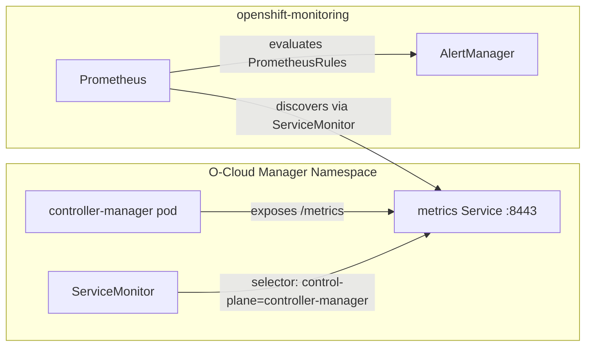
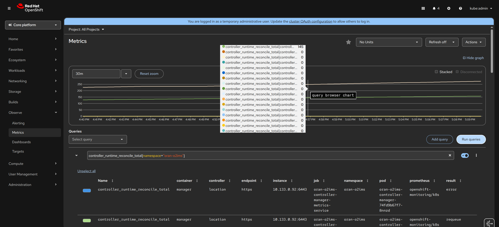

# Prometheus Metrics

This document describes how Prometheus metrics are configured and collected
for the O-Cloud Manager operator.

## Architecture

The operator exposes metrics via the standard `/metrics` HTTP endpoint on port
8443, served by the controller-runtime metrics server with TLS enabled. The
OpenShift cluster monitoring stack (Prometheus) discovers and scrapes this
endpoint through a `ServiceMonitor` resource deployed alongside the operator.



Since the operator is installed via OLM into a platform-managed namespace, the
**cluster-level** Prometheus instance handles metrics collection automatically.

## Configuration Files

| File | Purpose |
|------|---------|
| `config/prometheus/monitor.yaml` | ServiceMonitor telling Prometheus to scrape the operator |
| `config/prometheus/kustomization.yaml` | Kustomize resource list for the prometheus overlay |
| `config/rbac/metrics_service.yaml` | Service exposing port 8443 with OCP serving-cert annotation |
| `config/rbac/metrics_service_clusterrole.yaml` | ClusterRole granting GET on `/metrics` non-resource URL |
| `config/default/kustomization.yaml` | Includes `../prometheus` to deploy the ServiceMonitor |

## Default Metrics

The controller-runtime framework automatically registers the following metrics
(among others):

| Metric | Type | Description |
|--------|------|-------------|
| `controller_runtime_reconcile_total` | Counter | Total reconciliations by controller and result |
| `controller_runtime_reconcile_errors_total` | Counter | Total reconciliation errors |
| `controller_runtime_reconcile_time_seconds` | Histogram | Reconciliation duration |
| `workqueue_depth` | Gauge | Current depth of the work queue |
| `workqueue_adds_total` | Counter | Total items added to the work queue |
| `workqueue_queue_duration_seconds` | Histogram | Time items spend in the queue |

Standard Go runtime metrics (`go_goroutines`, `go_memstats_*`, `process_*`)
are also exposed.

## Verifying Metrics on a Cluster

### 1. Check the ServiceMonitor is deployed

```bash
oc get servicemonitor -n oran-o2ims
```

Expected output:

```text
NAME                                           AGE
oran-o2ims-controller-manager-metrics-monitor  ...
```

### 2. Check Prometheus has discovered the target

Get the OpenShift web console URL and open it in a browser:

```bash
oc get routes -n openshift-console -o jsonpath='{.items[0].spec.host}'
```

Log in with `kubeadmin` or your IDP credentials, then navigate to
**Observe > Targets** and filter by namespace `oran-o2ims`. The target
should show status **Up**.

Alternatively, from the CLI:

```bash
# List all targets via the Prometheus API (requires cluster-monitoring-view role)
oc -n openshift-monitoring exec -c prometheus prometheus-k8s-0 -- \
  curl -s http://localhost:9090/api/v1/targets | \
  jq '.data.activeTargets[] | select(.labels.namespace=="oran-o2ims") | {endpoint: .scrapeUrl, health: .health}'
```

### 3. Verify metrics are being collected (CLI)

Exec into the Prometheus pod and query the operator metrics endpoint directly:

```bash
oc -n openshift-monitoring exec -it -c prometheus prometheus-k8s-0 -- sh
wget -qO- --no-check-certificate \
  --header="Authorization: Bearer $(cat /var/run/secrets/kubernetes.io/serviceaccount/token)" \
  https://oran-o2ims-controller-manager-metrics-service.oran-o2ims.svc:8443/metrics
```

### 5. Sample PromQL queries (Web Console)

Open **Observe > Metrics** in the web console and try:

```promql
controller_runtime_reconcile_total{namespace="oran-o2ims"}
```



## RBAC

The operator's ClusterRole includes permissions for `monitoring.coreos.com`
resources:

- `servicemonitors`: get, list, watch
- `prometheusrules`: get, list, watch, create, update, patch, delete

These are generated from `//+kubebuilder:rbac` markers and propagated via
`make generate && make manifests && make bundle`.

## Adding Custom Metrics

To add application-specific metrics (e.g., authentication failure counters):

1. Import `github.com/prometheus/client_golang/prometheus` (already a
   transitive dependency via controller-runtime).
2. Define and register your metric (counter, gauge, histogram).
3. Increment/observe in the relevant code paths.
4. The metric is automatically served on the existing `/metrics` endpoint.
5. Optionally add a `PrometheusRule` in `config/prometheus/` to define alerts.
