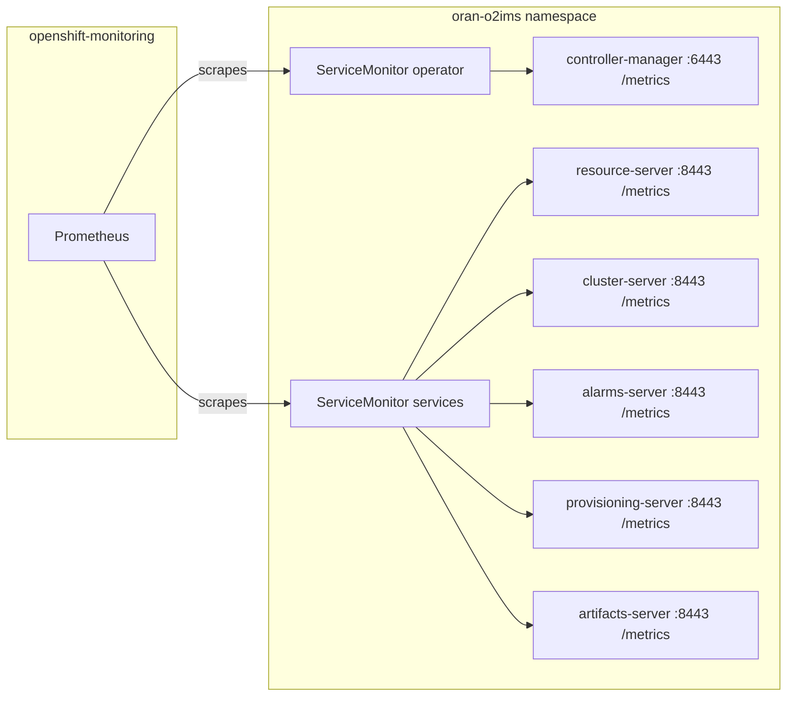

# Prometheus Metrics

This document describes how Prometheus metrics are configured and collected
for the O-Cloud Manager operator **and** its O2IMS service pods.

## Table of Contents

- [Architecture](#architecture)
- [Configuration Files](#configuration-files)
- [Network Policies](#network-policies)
- [RBAC](#rbac)
- [Operator Metrics (controller-manager)](#operator-metrics-controller-manager)
- [Service Pod Metrics (O2IMS API Servers)](#service-pod-metrics-o2ims-api-servers)
- [Alert Rules (PrometheusRule)](#alert-rules-prometheusrule)
- [End-to-End Verification](#end-to-end-verification)
- [Adding New Metrics](#adding-new-metrics)

## Architecture

The O-Cloud Manager exposes Prometheus metrics at two layers:

1. **Operator layer** — The `controller-manager` pod uses controller-runtime's
   built-in metrics server on port 6443, serving reconciliation and workqueue
   metrics.
2. **Service layer** — Each O2IMS API service pod (`alarms-server`,
   `cluster-server`, `provisioning-server`, `resource-server`,
   `artifacts-server`) exposes application-level metrics on its existing TLS
   port 8443 at `/metrics`.

Both layers are scraped by the OpenShift platform Prometheus via dedicated
`ServiceMonitor` resources.



For the platform Prometheus instance (in `openshift-monitoring`) to discover
ServiceMonitors in the operator namespace, the namespace must carry the label
`openshift.io/cluster-monitoring: "true"`. The Inventory controller ensures
this label is present on the operator namespace at every reconciliation cycle.

## Configuration Files

| File | Purpose |
|------|---------|
| `config/prometheus/monitor.yaml` | ServiceMonitor for the operator (controller-manager) |
| `config/prometheus/services-monitor.yaml` | ServiceMonitor for O2IMS API service pods |
| `config/prometheus/auth-alerts.yaml` | PrometheusRule with authentication failure alerts |
| `config/prometheus/kustomization.yaml` | Kustomize resource list for the prometheus overlay |
| `config/rbac/metrics_service.yaml` | Service exposing port 8443 with OCP serving-cert annotation |
| `config/rbac/metrics_service_clusterrole.yaml` | ClusterRole granting GET on `/metrics` non-resource URL |
| `config/default/kustomization.yaml` | Includes `../prometheus` to deploy both ServiceMonitors and PrometheusRule |

---

## Network Policies

The operator creates a `NetworkPolicy` for each server pod (CNF-24945) that
restricts ingress to explicitly allowed sources. Since Prometheus runs in the
`openshift-monitoring` namespace (outside the operator namespace), the
NetworkPolicy must explicitly permit monitoring traffic; otherwise scraping
will be blocked.

### Ingress rules by server type

| Server | Ingress allowed from |
|--------|---------------------|
| API servers (resource, cluster, alarms, artifacts, provisioning) | OpenShift ingress controller, OpenShift monitoring, same namespace |
| Alarms server (additional) | ACM alertmanager (`open-cluster-management-observability`) |
| Database (postgres) | Same namespace only |

### How monitoring ingress is granted

All servers with `ExternalIngress` scope include a rule that allows traffic
from any namespace labeled `network.openshift.io/policy-group: monitoring`.
In a standard OpenShift cluster, the `openshift-monitoring` namespace carries
this label, enabling Prometheus to reach port 8443 on the service pods:

```yaml
- from:
    - namespaceSelector:
        matchLabels:
          network.openshift.io/policy-group: monitoring
  ports:
    - protocol: TCP
      port: 8443
```

The database (`postgres-server`) has `InternalOnly` scope and does **not**
receive this rule since it does not expose a `/metrics` endpoint.

### RBAC for metrics

The **operator metrics** (controller-manager) are protected by controller-runtime's
built-in authn/authz middleware, which validates bearer tokens against the
kube-apiserver. The `metrics-reader` ClusterRole grants GET on the `/metrics`
non-resource URL so that Prometheus's ServiceAccount token is authorized.

The **service pod metrics** do **not** require additional RBAC. The `/metrics`
handler is registered on the base mux before the OAuth/SubjectAccessReview
middleware chain, so no application-level authentication or authorization
check is performed on metrics requests. The ServiceMonitor's
`bearerTokenFile` setting adds an HTTP `Authorization` header to scrape
requests, but since the middleware is bypassed this token is not validated
by the service. The effective access controls for the `/metrics` endpoint
are:

1. **Network layer** — NetworkPolicy restricts which namespaces can reach
   port 8443 (only `openshift-monitoring` and same-namespace pods).
2. **TLS transport** — The connection uses the service's serving certificate;
   however, `insecureSkipVerify: true` in the ServiceMonitor means the
   scraper does not validate the server certificate.

In practice, network reachability (controlled by the NetworkPolicy) is the
primary gate preventing unauthorized metrics access.

---

## RBAC

The operator's ClusterRole includes permissions for `monitoring.coreos.com`
resources:

- `servicemonitors`: get, list, watch
- `prometheusrules`: get, list, watch, create, update, patch, delete

These are generated from `//+kubebuilder:rbac` markers and propagated via
`make generate && make manifests && make bundle`.

---

## Operator Metrics (controller-manager)

The controller-runtime framework automatically registers the following metrics
(among others):

| Metric | Type | Description |
|--------|------|-------------|
| `controller_runtime_reconcile_total` | Counter | Total reconciliations by controller and result |
| `controller_runtime_reconcile_errors_total` | Counter | Total reconciliation errors |
| `controller_runtime_reconcile_time_seconds` | Histogram | Reconciliation duration |
| `workqueue_depth` | Gauge | Current depth of the work queue |
| `workqueue_adds_total` | Counter | Total items added to the work queue |
| `workqueue_queue_duration_seconds` | Histogram | Time items spend in the queue |

Standard Go runtime metrics (`go_goroutines`, `go_memstats_*`, `process_*`)
are also exposed.

---

## Service Pod Metrics (O2IMS API Servers)

### Design

The O2IMS service pods are plain `net/http` TLS servers (not controller-runtime
processes). To expose Prometheus metrics without adding new ports or changing
the deployment topology, we register `promhttp.Handler()` on each service's
existing `http.ServeMux` at the `/metrics` path.

Key design choices:

- **Same port (8443)** — The `/metrics` endpoint shares the existing TLS port.
  No new Service ports, container ports, or Deployment changes are needed.
- **Bypasses auth middleware** — The handler is registered on the base mux
  *before* the OAuth/SubjectAccessReview middleware chain, so Prometheus can
  scrape using its ServiceAccount bearer token without being rejected.
- **Shared metrics package** — All metric definitions live in
  `internal/service/common/metrics/metrics.go` to avoid duplication.
- **Label-based ServiceMonitor selector** — Services that expose `/metrics` are
  labeled `oran-o2ims/metrics: "true"` by the Inventory controller. The
  database (`postgres-server`) is excluded. The hardware manager exposes
  controller-runtime metrics on its own metrics port but is not currently
  selected by this ServiceMonitor (it uses the controller-runtime metrics
  server pattern, similar to the main controller-manager).

### Metrics Exposed

| Metric | Type | Labels | Description |
|--------|------|--------|-------------|
| `o2ims_auth_failures_total` | Counter | `service`, `type`, `method`, `path` | Authentication/authorization failures |

Label values:

- **`service`** — identifies the pod: `alarms-server`, `cluster-server`,
  `provisioning-server`, `resource-server`, `artifacts-server`
- **`type`** — failure category: `authentication` (HTTP 401),
  `authorization` (HTTP 403), or `certificate_binding` (RFC 8705 mTLS
  verification failure)
- **`method`** — HTTP method: `GET`, `POST`, `PATCH`, `DELETE`
- **`path`** — normalized request URL path with UUID segments replaced by
  `{id}` to bound cardinality (e.g.,
  `/o2ims-infrastructureInventory/v1/resourcePools/{id}/resources/{id}`)

Example scrape output:

```text
o2ims_auth_failures_total{service="alarms-server",type="authentication",method="GET",path="/o2ims-infrastructureMonitoring/v1/alarms"} 12
o2ims_auth_failures_total{service="cluster-server",type="authorization",method="POST",path="/o2ims-infrastructureCluster/v1/nodeClusters/{id}"} 3
o2ims_auth_failures_total{service="resource-server",type="certificate_binding",method="GET",path="/o2ims-infrastructureInventory/v1/resourcePools/{id}"} 1
```

Standard Go runtime metrics and default process metrics are also served since
they are automatically registered in the default Prometheus registry.

### ServiceMonitor for Services

The services ServiceMonitor (`config/prometheus/services-monitor.yaml`) selects
all API service pods via the `oran-o2ims/metrics: "true"` label:

```yaml
spec:
  endpoints:
    - path: /metrics
      port: api
      scheme: https
      bearerTokenFile: /var/run/secrets/kubernetes.io/serviceaccount/token
      tlsConfig:
        insecureSkipVerify: true
  selector:
    matchLabels:
      oran-o2ims/metrics: "true"
```

This ServiceMonitor is included in the OLM bundle at
`bundle/manifests/oran-o2ims-o2ims-services-metrics-monitor_monitoring.coreos.com_v1_servicemonitor.yaml`.

---

## Alert Rules (PrometheusRule)

A `PrometheusRule` resource (`config/prometheus/auth-alerts.yaml`) defines
alerting rules for authentication failures. These are evaluated by the
platform Prometheus and route through AlertManager.

| Alert | Severity | Condition | Description |
|-------|----------|-----------|-------------|
| `O2IMSHighAuthFailureRate` | warning | `sum(rate(o2ims_auth_failures_total[5m])) by (service, type) > 0.1667` sustained for 5 min (>10/min) | A service is experiencing a high rate of authentication or authorization failures |
| `O2IMSCertificateBindingFailure` | critical | Any `certificate_binding` failure in the last 10 min | RFC 8705 client certificate mismatch — potential stolen token replay |

The `O2IMSCertificateBindingFailure` alert is critical because it may indicate
a token theft: the bearer token is valid but the presenting client does not
possess the private key corresponding to the certificate bound to the token.

### Verifying alert rules

After deployment, confirm the PrometheusRule is loaded:

```bash
oc get prometheusrule -n oran-o2ims
```

Check that Prometheus has loaded the rules:

```bash
oc -n openshift-monitoring exec -c prometheus prometheus-k8s-0 -- \
  curl -s http://localhost:9090/api/v1/rules | \
  jq '.data.groups[] | select(.name=="o2ims-auth") | .rules[].name'
```

Expected output:

```text
"O2IMSHighAuthFailureRate"
"O2IMSCertificateBindingFailure"
```

### Testing alert lifecycle (inactive → pending → firing)

To fully exercise the `O2IMSHighAuthFailureRate` alert and observe its
lifecycle transitions, generate sustained authentication failures above the
threshold (>10/min) for longer than the `for: 5m` duration.

#### Step 1: Start sustained load

From the Prometheus pod, send unauthenticated requests at ~30/min (one every
2 seconds). This exceeds the 10/min threshold:

```bash
oc -n openshift-monitoring exec -c prometheus prometheus-k8s-0 -- \
  sh -c 'for i in $(seq 1 200); do
    wget -qO- --no-check-certificate \
      https://resource-server.oran-o2ims.svc:8443/o2ims-infrastructureInventory/v1/resourcePools 2>/dev/null
    sleep 2
  done'
```

This runs for ~400 seconds (~6.7 minutes), which is enough to trigger and
sustain the alert.

#### Step 2: Monitor the current rate

After ~2 minutes, the 5-minute rolling rate should cross the 0.1667/s
threshold:

```bash
oc -n openshift-monitoring exec -c prometheus prometheus-k8s-0 -- \
  curl -s --data-urlencode \
    'query=sum by (service, type) (rate(o2ims_auth_failures_total[5m]))' \
    http://localhost:9090/api/v1/query | \
  jq '.data.result[] | {service: .metric.service, type: .metric.type, rate_per_sec: .value[1]}'
```

Expected output (rate > 0.1667):

```json
{
  "service": "resource-server",
  "type": "authentication",
  "rate_per_sec": "0.29"
}
```

#### Step 3: Observe state transitions

Check the alert rule state via the rules API:

```bash
oc -n openshift-monitoring exec -c prometheus prometheus-k8s-0 -- \
  curl -s http://localhost:9090/api/v1/rules | \
  jq '.data.groups[] | select(.name=="o2ims-auth") | .rules[] |
      {name: .name, state: .state, alerts: [.alerts[] | {state, activeAt: .activeAt}]}'
```

Expected lifecycle:

| Time after load starts | Expected state | Explanation |
|------------------------|---------------|-------------|
| 0–2 min | `inactive` | Rate is still below threshold (building up in the 5m window) |
| ~2 min | `pending` | Rate crosses 0.1667/s; the `for: 5m` timer starts |
| ~7 min (2 + 5) | `firing` | Rate has been above threshold for 5 consecutive minutes |
| ~12 min after load stops | `inactive` | The 5m rate window clears and drops below threshold |

#### Step 4: Confirm the alert in the alerts API

Once the alert is `firing`, verify it appears in the alerts endpoint (the same
data that AlertManager receives):

```bash
oc -n openshift-monitoring exec -c prometheus prometheus-k8s-0 -- \
  curl -s http://localhost:9090/api/v1/alerts | \
  jq '.data.alerts[] | select(.labels.alertname | startswith("O2IMS"))'
```

Expected output:

```json
{
  "labels": {
    "alertname": "O2IMSHighAuthFailureRate",
    "namespace": "oran-o2ims",
    "service": "resource-server",
    "severity": "warning",
    "type": "authentication"
  },
  "annotations": {
    "description": "Service resource-server is experiencing more than 10 authentication failures per minute over the last 5 minutes. Current rate: 322.2m/s.",
    "runbook_url": "https://github.com/openshift-kni/oran-o2ims/blob/main/docs/dev/prometheus-metrics.md#alert-rules-prometheusrule",
    "summary": "High authentication failure rate on resource-server"
  },
  "state": "firing"
}
```

#### Step 5: Verify alert resolves

After the load generator finishes, the rate will decay as the 5-minute window
advances past the period of failures. Once the rate drops below 0.1667/s, the
alert returns to `inactive`. Confirm by re-running the rules query from Step 3
after ~5–7 minutes of inactivity.

---

## End-to-End Verification

Testing metrics on a live cluster is a **two-phase** process:

1. **Phase 1: Target Discovery** — Verify Prometheus has discovered the
   ServiceMonitor and the service endpoints appear as active targets.
2. **Phase 2: Metric Scraping** — Confirm metrics are actually being collected
   and queryable via PromQL.

### Phase 1: Target Discovery

#### Pre-requisite: Namespace monitoring label

The platform Prometheus only watches namespaces with the
`openshift.io/cluster-monitoring: "true"` label. The Inventory controller
applies this label automatically. Confirm it is present:

```bash
oc get ns oran-o2ims --show-labels | grep cluster-monitoring
```

If the label is missing, ServiceMonitors in the namespace will **not** be
discovered by Prometheus regardless of their configuration.

#### Check ServiceMonitors are deployed

```bash
oc get servicemonitor -n oran-o2ims
```

Expected output:

```text
NAME                                           AGE
oran-o2ims-controller-manager-metrics-monitor  ...
oran-o2ims-o2ims-services-metrics-monitor      ...
```

#### Verify Prometheus discovered the targets

From the CLI, query the Prometheus targets API:

```bash
oc -n openshift-monitoring exec -c prometheus prometheus-k8s-0 -- \
  curl -s http://localhost:9090/api/v1/targets | \
  jq '.data.activeTargets[] | select(.labels.namespace=="oran-o2ims") | {endpoint: .scrapeUrl, health: .health}'
```

You should see entries for **each** API service pod with `"health": "up"`:

```json
{"endpoint": "https://10.x.x.x:8443/metrics", "health": "up"}
{"endpoint": "https://10.x.x.x:8443/metrics", "health": "up"}
...
```

Alternatively, in the OpenShift web console navigate to **Observe > Targets**
and filter by namespace `oran-o2ims`. All targets should show status **Up**.

> **Note:** After deploying a new ServiceMonitor, Prometheus may take 1–3
> minutes to reload its configuration and discover the new targets. Target
> discovery depends on the prometheus-operator watch cycle (which detects
> the new ServiceMonitor) and Prometheus's configuration reload. If targets
> don't appear immediately, wait and retry. You can check when the
> configuration was last reloaded with:
>
> ```bash
> oc -n openshift-monitoring exec -c prometheus prometheus-k8s-0 -- \
>   curl -s http://localhost:9090/api/v1/status/runtimeinfo | \
>   jq '.data.lastConfigTime'
> ```

### Phase 2: Metric Scraping via PromQL

Once targets are **Up**, metrics are being scraped. Verify with PromQL queries.

> **Note:** Metrics only appear in PromQL results after at least one scrape
> cycle has collected them. OpenShift's platform Prometheus uses a **30-second
> global scrape interval** by default. If you trigger a counter increment and
> query immediately, wait up to 30 seconds for the value to appear in query
> results. You can verify the configured interval with:
>
> ```bash
> oc -n openshift-monitoring exec -c prometheus prometheus-k8s-0 -- \
>   curl -s http://localhost:9090/api/v1/status/config | \
>   jq -r '.data.yaml' | grep 'scrape_interval'
> ```

#### Via the CLI (from the Prometheus pod)

```bash
oc -n openshift-monitoring exec -c prometheus prometheus-k8s-0 -- \
  curl -s 'http://localhost:9090/api/v1/query?query=o2ims_auth_failures_total' | jq .
```

#### Via the OpenShift web console

Open **Observe > Metrics** and run:

```promql
o2ims_auth_failures_total{namespace="oran-o2ims"}
```

To see failures broken down by service and type:

```promql
sum by (service, type) (o2ims_auth_failures_total{namespace="oran-o2ims"})
```

For operator metrics, use:

```promql
controller_runtime_reconcile_total{namespace="oran-o2ims"}
```

#### Triggering test data

The `o2ims_auth_failures_total` counter only appears after at least one
authentication or authorization failure has occurred. To trigger a test failure,
send an unauthenticated request to any service endpoint:

```bash
oc -n openshift-monitoring exec -c prometheus prometheus-k8s-0 -- \
  wget -qO- --no-check-certificate https://resource-server.oran-o2ims.svc:8443/o2ims-infrastructureInventory/v1/resourcePools 2>&1 || true
```

Then re-query with PromQL — the counter should now appear with
`type="authentication"`.

#### Direct endpoint check (optional)

You can also scrape a service directly from the Prometheus pod to verify the
raw metrics output:

```bash
oc -n openshift-monitoring exec -c prometheus prometheus-k8s-0 -- \
  wget -qO- --no-check-certificate \
  --header="Authorization: Bearer $(cat /var/run/secrets/kubernetes.io/serviceaccount/token)" \
  https://resource-server.oran-o2ims.svc:8443/metrics
```

---

## Adding New Metrics

To add new application-specific metrics to the service pods:

1. Define the metric in `internal/service/common/metrics/metrics.go` using the
   `prometheus` client library (Counter, Gauge, Histogram, or Summary).
2. Register it with `prometheus.MustRegister()` in the package `init()`.
3. Increment/observe in the relevant code paths, using the `service` label to
   identify which pod reported the metric.
4. The metric is automatically served on the existing `/metrics` endpoint via
   `promhttp.Handler()` (no additional registration needed).
5. Optionally add a `PrometheusRule` in `config/prometheus/` to define alerts
   based on the new metric.
