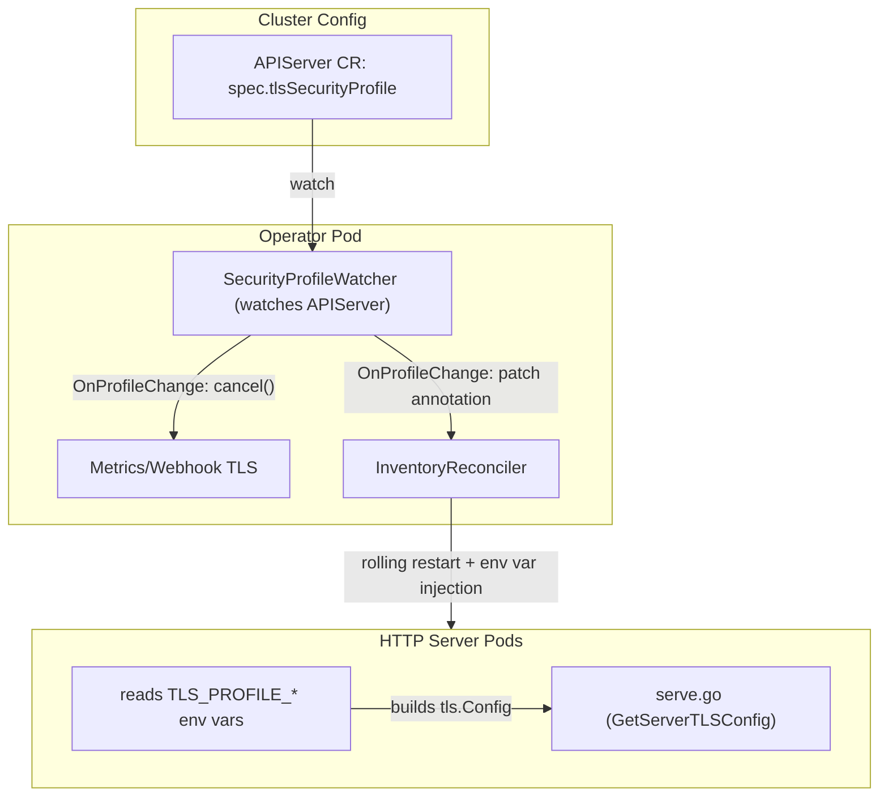
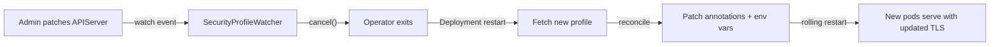

<!--
SPDX-FileCopyrightText: Red Hat

SPDX-License-Identifier: Apache-2.0
-->

# TLS Configuration

This document describes how the O-Cloud Manager operator inherits and
enforces the cluster-wide TLS security profile defined in
`apiservers.config.openshift.io/cluster`, according to
[CNF-21985](https://redhat.atlassian.net/browse/CNF-21985).

- [Motivation](#motivation)
- [Implementation Approach](#implementation-approach)
- [Architecture](#architecture)
- [Operator-Driven Rolling Restart](#operator-driven-rolling-restart)
- [Cluster Testing Procedure](#cluster-testing-procedure)
  - [Test 1: Default Profile Verification](#test-1-default-profile-verification)
  - [Test 2: Profile Change and Enforcement](#test-2-profile-change-and-enforcement)
- [TLS Scanner](#tls-scanner)
  - [Building and Pushing the Image](#building-and-pushing-the-image)
  - [Running the Scanner](#running-the-scanner)
  - [Results (Default Intermediate Profile)](#results-default-intermediate-profile)

## Motivation

OpenShift provides a centrally managed TLS security profile so that cluster
administrators can enforce consistent cryptographic policy across the entire
platform from a single resource. This is critical for **Post-Quantum
Cryptography (PQC) readiness** — TLS 1.3+ is required for PQC-resilient
algorithms, and customers expect all layered products to comply when they
adjust the cluster profile.

Previously, this operator **hardcoded** TLS settings in Go source code:

```go
config = &tls.Config{MinVersion: tls.VersionTLS12}
config.CipherSuites = pfsCipherSuites // all ECDHE cipher suites
```

This approach was insufficient because:

1. **No policy alignment** — The operator ignored the cluster's TLS security
   profile entirely (declared `tls-profiles: "false"` in its CSV).
2. **No dynamic compliance** — Changing the cluster profile had no effect on
   the operator or its managed pods. An administrator setting `Modern`
   (TLS 1.3 only) would still have backends accepting TLS 1.2.
3. **PQC blocker** — Hardcoded cipher suites prevent the platform from
   transparently adopting post-quantum algorithms when they become available.
4. **Audit failure** — Security scans (`tls-scanner`) would flag the operator
   as non-compliant with the cluster's intended policy.

The fix removes all hardcoded TLS configuration and replaces it with dynamic
inheritance from the `APIServer` resource, ensuring the operator and all its
managed HTTP server pods always match the cluster's configured TLS profile.

## Implementation Approach

This project uses **controller-runtime** (not library-go's operator framework),
so the implementation follows the "Direct Go Application Code (`crypto/tls.Config`)"
path from the
[TLS Profile Compliance Remediation Guidance](https://docs.google.com/document/d/1cMc9E8psHfnoK06ntR8kHSWB8d3rMtmldhnmM4nImjs/edit):

1. **Fetch** the `TLSSecurityProfile` from `apiservers.config.openshift.io/cluster`
   using the `github.com/openshift/controller-runtime-common/pkg/tls` package.
2. **Extract** the resolved profile spec — handling built-in profiles (Old,
   Intermediate, Modern) and Custom profiles with explicit cipher lists.
3. **Convert** OpenSSL-style cipher names to Go's `crypto/tls` constants and
   map `VersionTLS1x` strings to `tls.VersionTLS1x` integer constants.
4. **Handle TLS 1.3** correctly — Go manages TLS 1.3 cipher suites internally;
   the `CipherSuites` field only applies to TLS 1.2 and below.
5. **Explicitly set** `MinVersion` and `CipherSuites` on every `tls.Config`
   rather than relying on Go defaults.
6. **Propagate** profile settings from the operator to HTTP server pods via
   environment variables (`TLS_PROFILE_MIN_VERSION`, `TLS_PROFILE_CIPHERS`),
   avoiding the need for server pods to have direct API Server read access.

The **API Server profile** is the correct source for all our components
because our pods are backend workloads behind the OpenShift Router (reencrypt
termination). They never handshake directly with external clients — the
Router handles external TLS. Our pods' TLS role is equivalent to any
internal component-to-component connection, which the guidance explicitly
maps to the API Server profile.

## Architecture



Key design decisions:

- **HTTP server pods do not watch or fetch the API Server resource.** The
  operator reads the profile once, computes a hash, and injects the
  settings as environment variables into the pod spec. This avoids granting
  additional RBAC to server pod ServiceAccounts.
- **Profile changes trigger rolling restarts** via annotation changes on
  the pod template. The new pods start with the updated environment
  variables and apply the new TLS configuration at startup.
- **The operator itself restarts** when the profile changes because
  `controller-runtime` does not support modifying `TLSOpts` on a running
  manager. The `SecurityProfileWatcher` calls `cancel()` on the manager
  context, causing a graceful shutdown. The operator's Deployment then
  restarts it with the new profile.

## Operator-Driven Rolling Restart

When the cluster TLS profile changes, the following sequence occurs:



This operator-driven approach was chosen because:

- It matches the pattern recommended in the
  [TLS Profile Compliance Remediation Guidance](https://docs.google.com/document/d/1cMc9E8psHfnoK06ntR8kHSWB8d3rMtmldhnmM4nImjs/edit)
  and the
  [cluster-machine-approver reference](https://github.com/openshift/cluster-machine-approver/pull/286)
- The operator already orchestrates the server Deployments
- Only the operator needs WATCH access to `apiservers.config.openshift.io`
- Profile changes are admin-initiated and rare; brief rolling restarts
  are acceptable

## Cluster Testing Procedure

The following procedure validates that the TLS profile is correctly
inherited, propagated, and enforced on a real OpenShift cluster.

### Prerequisites

```bash
export KUBECONFIG=/path/to/kubeconfig
# Verify the operator is deployed and pods are running
oc get pods -n oran-o2ims
```

All HTTP server pods (`resource-server`, `cluster-server`,
`provisioning-server`, `artifacts-server`) should be in `Running` state.

### Test 1: Default Profile Verification

With no explicit `tlsSecurityProfile` set on the APIServer (defaults to
Intermediate: TLS 1.2 minimum, ECDHE cipher suites):

**1.1 Verify the operator loaded the correct profile:**

```bash
oc logs -n oran-o2ims deployment/oran-o2ims-controller-manager \
  | grep "TLS profile loaded"
```

Expected output:

```json
{"level":"INFO","msg":"Cluster TLS profile loaded","minVersion":"VersionTLS12"}
```

**1.2 Verify environment variables are propagated to server pods:**

```bash
oc get pod -n oran-o2ims -l app=resource-server \
  -o jsonpath='{.items[0].spec.containers[0].env}' | python3 -m json.tool \
  | grep -A1 TLS_PROFILE
```

Expected: `TLS_PROFILE_MIN_VERSION=VersionTLS12` and
`TLS_PROFILE_CIPHERS` containing Intermediate profile ciphers
(e.g. `ECDHE-RSA-AES128-GCM-SHA256,ECDHE-RSA-AES256-GCM-SHA384,...`).

**1.3 Verify TLS 1.1 is rejected and TLS 1.2/1.3 are accepted:**

Run a test pod inside the cluster:

```bash
oc run tls-test --rm -i --restart=Never \
  --image=registry.access.redhat.com/ubi9/ubi:latest -n oran-o2ims \
  --overrides='{"spec":{"securityContext":{"runAsNonRoot":true,
    "seccompProfile":{"type":"RuntimeDefault"}},"containers":[{"name":"tls-test",
    "image":"registry.access.redhat.com/ubi9/ubi:latest","command":["bash","-c",
    "echo \"=== TLS 1.1 (expect FAIL) ===\"
     echo | openssl s_client -connect resource-server.oran-o2ims.svc.cluster.local:8443 -tls1_1 2>&1 | grep -E \"error|Protocol|Cipher\"
     echo \"=== TLS 1.2 (expect PASS) ===\"
     echo | openssl s_client -connect resource-server.oran-o2ims.svc.cluster.local:8443 -tls1_2 2>&1 | grep -E \"Protocol|Cipher\" | head -3
     echo \"=== TLS 1.3 (expect PASS) ===\"
     echo | openssl s_client -connect resource-server.oran-o2ims.svc.cluster.local:8443 -tls1_3 2>&1 | grep -E \"Protocol|Cipher\" | head -3"],
    "securityContext":{"allowPrivilegeEscalation":false,"capabilities":{"drop":["ALL"]}}}]}}'
```

Expected results:

| Connection attempt | Expected result |
|--------------------|-----------------|
| TLS 1.1 | `error: no protocols available` — **rejected** |
| TLS 1.2 | `Cipher is ECDHE-RSA-AES128-GCM-SHA256` — **accepted** |
| TLS 1.3 | `Cipher is TLS_AES_128_GCM_SHA256` — **accepted** |

### Test 2: Profile Change and Enforcement

This test verifies the full lifecycle: profile change → operator restart →
pod rollout → new TLS enforcement.

**2.1 Store current configuration for later revert:**

```bash
oc get apiserver cluster -o yaml > /tmp/apiserver-original.yaml
```

**2.2 Apply the Modern profile (TLS 1.3 only):**

```bash
oc patch apiserver cluster --type=merge \
  -p '{"spec":{"tlsSecurityProfile":{"type":"Modern","modern":{}}}}'
```

**2.3 Wait for the operator to restart and pods to roll (30-40 seconds):**

```bash
# Watch for new pod creation timestamps
oc get pods -n oran-o2ims -w
```

**2.4 Verify the operator loaded the Modern profile:**

```bash
oc logs -n oran-o2ims deployment/oran-o2ims-controller-manager \
  | grep "TLS profile loaded"
```

Expected:

```json
{"level":"INFO","msg":"Cluster TLS profile loaded","minVersion":"VersionTLS13"}
```

**2.5 Verify TLS 1.2 is now rejected:**

```bash
oc run tls-modern-test --rm -i --restart=Never \
  --image=registry.access.redhat.com/ubi9/ubi:latest -n oran-o2ims \
  --overrides='{"spec":{"securityContext":{"runAsNonRoot":true,
    "seccompProfile":{"type":"RuntimeDefault"}},"containers":[{"name":"tls-modern-test",
    "image":"registry.access.redhat.com/ubi9/ubi:latest","command":["bash","-c",
    "echo \"=== TLS 1.2 (expect FAIL with Modern) ===\"
     echo | openssl s_client -connect resource-server.oran-o2ims.svc.cluster.local:8443 -tls1_2 2>&1 | grep -E \"error|alert|Cipher\"
     echo \"=== TLS 1.3 (expect PASS) ===\"
     echo | openssl s_client -connect resource-server.oran-o2ims.svc.cluster.local:8443 -tls1_3 2>&1 | grep -E \"Protocol|Cipher\" | head -3"],
    "securityContext":{"allowPrivilegeEscalation":false,"capabilities":{"drop":["ALL"]}}}]}}'
```

Expected results:

| Connection attempt | Expected result |
|--------------------|-----------------|
| TLS 1.2 | `tlsv1 alert protocol version` — **rejected** |
| TLS 1.3 | `Cipher is TLS_AES_128_GCM_SHA256` — **accepted** |

**2.6 (Optional) Test Custom profile with specific ciphers:**

```bash
oc patch apiserver cluster --type=merge \
  -p '{"spec":{"tlsSecurityProfile":{"type":"Custom","modern":null,
    "custom":{"ciphers":["ECDHE-RSA-AES128-GCM-SHA256",
    "ECDHE-RSA-AES256-GCM-SHA384"],"minTLSVersion":"VersionTLS12"}}}}'
```

After pods restart, verify that only the listed ciphers are accepted:

| Connection attempt | Expected result |
|--------------------|-----------------|
| `ECDHE-RSA-AES128-GCM-SHA256` | **Accepted** |
| `ECDHE-RSA-AES256-GCM-SHA384` | **Accepted** |
| `ECDHE-RSA-CHACHA20-POLY1305` (not in list) | `handshake failure` — **rejected** |

**2.7 Revert to original configuration:**

```bash
oc patch apiserver cluster --type=json \
  -p '[{"op":"remove","path":"/spec/tlsSecurityProfile"}]'
```

Wait 30-40 seconds for the rollout, then verify TLS 1.2 is accepted again.

### Success Criteria

The feature is working correctly when:

1. The operator log shows the correct `minVersion` matching the cluster's
   configured profile.
2. Server pods contain `TLS_PROFILE_MIN_VERSION` and `TLS_PROFILE_CIPHERS`
   environment variables matching the active profile.
3. Protocol versions below the profile minimum are rejected at the TLS
   handshake level.
4. Only cipher suites listed in the profile are accepted for TLS 1.2
   connections.
5. Changing the APIServer's `tlsSecurityProfile` triggers operator restart
   and rolling restart of all server pods within ~30 seconds.
6. After revert, the previous TLS behavior is restored.

## TLS Scanner

The [tls-scanner](https://github.com/openshift/tls-scanner) is an OpenShift
tool that performs comprehensive TLS compliance scanning against all pods in a
namespace. It uses `testssl.sh` under the hood to probe each endpoint and
produces a structured report with:

- TLS versions offered by each endpoint
- Cipher suites accepted (per protocol version)
- Forward secrecy validation
- ML-KEM / PQC readiness (post-quantum key exchange support)
- Compliance assessment against the cluster's configured API Server, Ingress,
  and Kubelet TLS profiles

This is particularly valuable for CNF-21985 validation because it provides an
automated, authoritative check that all our endpoints match the cluster's TLS
policy — rather than relying on manual `openssl s_client` probes.

### Building and Pushing the Image

Clone the tls-scanner repository and build/push the image to a registry
accessible by your cluster:

```bash
cd /path/to/tls-scanner
export SCANNER_IMAGE="quay.io/<your-username>/tls-scanner:1.0"
DOCKERFILE=Dockerfile.local ./deploy.sh build push
```

Ensure the image repository has public read access so cluster nodes can pull it.

### Running the Scanner

Deploy the scanner against the `oran-o2ims` namespace:

```bash
cd /path/to/tls-scanner
export KUBECONFIG=/path/to/kubeconfig
export SCANNER_IMAGE="quay.io/<your-username>/tls-scanner:1.0"
export NAMESPACE="oran-o2ims"
export NAMESPACE_FILTER="oran-o2ims"
./deploy.sh --verbose deploy
```

The scanner discovers all pods in the namespace, probes their listening ports
for TLS, and produces results in `./artifacts/` (CSV and JSON formats).

After the scan completes, clean up cluster resources:

```bash
./deploy.sh cleanup
```

### Results (Default Intermediate Profile)

With the cluster running the default Intermediate profile
(`spec.tlsSecurityProfile` unset on APIServer), the scanner reports:

| Pod | Port | TLS Versions | PQC Ready | API MinVersion Compliance | API Cipher Compliance |
|-----|------|-------------|-----------|---------------------------|----------------------|
| cluster-server | 8443 | TLSv1.2, TLSv1.3 | Yes (ML-KEM X25519MLKEM768) | true | true |
| oran-o2ims-controller-manager | 6443 | TLSv1.2, TLSv1.3 | Yes (ML-KEM X25519MLKEM768) | true | true |
| oran-o2ims-controller-manager | 9443 | TLSv1.2, TLSv1.3 | Yes (ML-KEM X25519MLKEM768) | true | true |
| artifacts-server | 8443 | TLSv1.2, TLSv1.3 | Yes (ML-KEM X25519MLKEM768) | true | true |
| provisioning-server | 8443 | TLSv1.2, TLSv1.3 | Yes (ML-KEM X25519MLKEM768) | true | true |
| resource-server | 8443 | TLSv1.2, TLSv1.3 | Yes (ML-KEM X25519MLKEM768) | true | true |

Key observations:

- **All endpoints pass API MinVersion Compliance** — the offered minimum TLS
  version matches (or exceeds) what the cluster profile requires.
- **All endpoints pass API Cipher Compliance** — only ciphers allowed by the
  Intermediate profile are offered.
- **All endpoints are PQC-ready** — ML-KEM (`X25519MLKEM768`) key exchange is
  supported, provided by Go 1.25's native TLS 1.3 implementation.
- **Forward Secrecy confirmed** on all TLS-enabled endpoints (only ECDHE
  and TLS 1.3 AEAD ciphers offered).
- **No weak ciphers** — NULL, export, DES, RC4, and CBC cipher categories are
  all confirmed "not offered".
- Scanner readiness note: *"Endpoint offers TLS 1.3 and ML-KEM — ready for
  Modern profile"*.

The `postgres-server` pod (port 5432) reports `NO_TLS` which is expected — it
uses PostgreSQL's native wire protocol without TLS on the pod network (traffic
is cluster-internal only).
