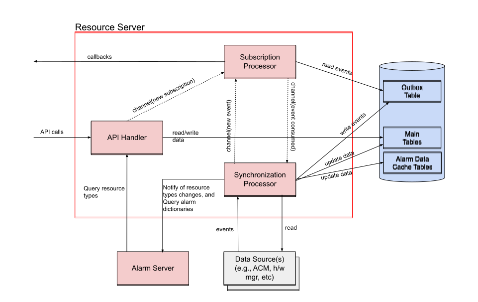

# Resource Server Scalability Enhancement

```yaml
title: resource-server-scalability-enhancement
authors:
* @alegacy
reviewers:
* @bartwensley
* @browsell
approvers:
* @browsell
api-approvers:
* TBD
creation-date: 2024-10-10
last-updated: 2024-10-10
tracking-link: # link to the tracking ticket (for example: Jira Feature or Epic ticket) that corresponds to this enhancement
* [ CNF-14144 ](https://issues.redhat.com/browse/CNF-14144)
see-also:
* "None"
replaces:
* "None"
superseded-by:
* "None"
```

## Table of Contents

<!-- TOC -->

* [Resource Server Scalability Enhancement](#resource-server-scalability-enhancement)
  * [Table of Contents](#table-of-contents)
  * [Summary](#summary)
  * [Goals](#goals)
  * [Database](#database)
    * [Schema](#schema)
    * [Extension Fields](#extension-fields)
      * [Resource Pool](#resource-pool)
      * [Resource](#resource)
      * [Deployment Manager](#deployment-manager)
    * [Initialization](#initialization)
    * [Data Synchronization](#data-synchronization)
    * [Generating event notifications](#generating-event-notifications)
    * [Postgres](#postgres)
  * [Consolidation of microservices](#consolidation-of-microservices)
    * [API Handler](#api-handler)
    * [Subscription Processor](#subscription-processor)
    * [Synchronization Processor](#synchronization-processor)
  * [Tooling and general dev guidelines](#tooling-and-general-dev-guidelines)
  * [Interactions with other services](#interactions-with-other-services)
    * [Alarm Server](#alarm-server)
  * [Future Updates](#future-updates)

## Summary

`O-RAN` requires `InfrastructureInventory Service API` which is a collection of APIs that can be queried by a client to
discover the inventory topology of the `o-cloud` infrastructure
([O-RAN.WG6.O2IMS-INTERFACE-R004-v07.00](https://specifications.o-ran.org/download?id=749).
This enhancement describes the changes required to the resource server and related components to improve its scalability
and to better support importing data from multiple sources (i.e., multiple hardware managers in addition to the
hub-cluster). The resource server is currently implemented as a simple pass-through to the ACM observability APIs. This
approach does not lend itself well to aggregating data from multiple sources in an efficient way. Specifically, it
exposes the following challenges.

* Need to invoke API endpoints on multiple downstream data sources for each client request
* Difficult to implement pagination when data is distributed across multiple data sources
* Data is not available locally for associations with other objects (i.e., mapping resource types to alarm objects)
* Lack of event notifications from downstream data sources (i.e., if downstream data sources do not publish events then
  the resource server must determine what changed so that it can publish events to its clients)

The intent of this enhancement is to leverage persistent storage to optimize the performance and scalability of the
resource server. Although caching via persistence does introduce a significant amount of complexity and overhead it
does address the listed concerns.

## Goals

* Define database schema
* Define database initialization
* Define database schema migration strategy
* Define workflow for importing and auditing data from external sources
* Consolidation of services
* Generation of event notifications

## Database

### Schema

All O-RAN services will use the same database service. More on DB deployment [here](#postgres). Tables specific to the
inventory service and resource server will be contained within the `resource_server` logical database.

Tables defined here represent a model combining objects and fields required by the API facing object model, and internal
fields required to manage the data. This represents a choice to define the database schema to align with the public API
facing model rather than to align with the downstream model of the source objects (i.e., h/w manager, ACM, etc). This
choice was made to make it easier to service API requests for filtering and event notifications since it minimizes how
much data conversion is required since subscription filters are expressed using the public API facing object model
representation.

The database schema will be managed as a set of data migration scripts. The [initial script](./resource-server.sql) will
define the initial database schema and subsequent scripts -- not defined here -- will update the schema for minor and
major upgrades.

> **Note**: The schema in `resource-server.sql` represents the initial design from October 2024. As of February 2026
> (O2IMS v11 compliance), the production schema has evolved to include new tables (`location`, `o_cloud_site`) and
> removed deprecated columns from `resource_pool` (`global_location_id`, `o_cloud_id`, `location`). See the actual
> migration files in `internal/service/resources/db/migrations/` for the current schema.

### Extension Fields

As discussed above, the database schema parallels the public facing API data model. Since the API data model is in
very early stages of development the set of attributes contained within each object is limited to the minimum required
set of attributes. It is expected that each vendor will need to publish more detailed attributes by leveraging the
extension attribute, and over time as commonality is found across multiple O-Cloud vendors that these extension
attributes will be normalized into the formal model definition. The following subsection lists the extensions currently
stored within the extensions attribute and passed directly onto the public facing API.

#### Resource Pool

For the hub-cluster:

```json
{
  "cloud": "Other",
  "cluster.open-cluster-management.io/clusterset": "default",
  "clusterID": "4caf8d44-dce4-4940-866b-6eba21862226",
  "feature.open-cluster-management.io/addon-application-manager": "available",
  "feature.open-cluster-management.io/addon-cert-policy-controller": "available",
  "feature.open-cluster-management.io/addon-config-policy-controller": "available",
  "feature.open-cluster-management.io/addon-governance-policy-framework": "available",
  "feature.open-cluster-management.io/addon-hypershift-addon": "available",
  "feature.open-cluster-management.io/addon-iam-policy-controller": "available",
  "feature.open-cluster-management.io/addon-managed-serviceaccount": "available",
  "feature.open-cluster-management.io/addon-work-manager": "available",
  "local-cluster": "true",
  "name": "local-cluster",
  "openshiftVersion": "4.15.15",
  "openshiftVersion-major": "4",
  "openshiftVersion-major-minor": "4.15",
  "velero.io/exclude-from-backup": "true",
  "vendor": "OpenShift"
}
```

For spokes:

```json
{
  "app.kubernetes.io/instance": "clusters",
  "cloud": "Other",
  "cluster.open-cluster-management.io/clusterset": "default",
  "clusterID": "53d9cd0b-bc4b-4a92-a826-704e71a569d9",
  "common-bos2kyoung04": "true",
  "du-profile": "v4.15",
  "feature.open-cluster-management.io/addon-config-policy-controller": "available",
  "feature.open-cluster-management.io/addon-governance-policy-framework": "available",
  "feature.open-cluster-management.io/addon-managed-serviceaccount": "available",
  "feature.open-cluster-management.io/addon-work-manager": "available",
  "group-bos2kyoung04": "",
  "name": "bos2kyoung04",
  "openshiftVersion": "4.15.16",
  "openshiftVersion-major": "4",
  "openshiftVersion-major-minor": "4.15",
  "sites": "bos2kyoung04",
  "vendor": "OpenShift",
  "ztp-done": ""
}
```

For nodes from hardware managers:

```json
{
  ...
  TBD
  ...
}
```

#### Resource

For nodes from ACM:

```json
{
  "beta.kubernetes.io/arch": "amd64",
  "beta.kubernetes.io/os": "linux",
  "kubernetes.io/arch": "amd64",
  "kubernetes.io/hostname": "hubcluster-ctlplane-1.example.com",
  "kubernetes.io/os": "linux",
  "node-role.kubernetes.io/control-plane": "",
  "node-role.kubernetes.io/master": "",
  "node-role.kubernetes.io/worker": "",
  "node.openshift.io/os_id": "rhcos"
}
```

For nodes from hardware managers:

```json
{
  "admin-state": "UNLOCKED",
  "operational-state": "ENABLED",
  "tenant": "default_tenant",
  "serial": "TBD",
  "sockets": "TBD",
  "cores": "TBD",
  "bios": "TBD",
  "memory": "TBD",
  "cpu-model": "Intel(R) Xeon(R) Gold 5318Y CPU @ 2.10GHz"
}

```

#### Deployment Manager

```json
{
  "profileName": "k8s",
  "profileData": {
    "admin_client_cert": "... base64 public certificate ...",
    "admin_client_key": "... base64 private key ...",
    "admin_user": "system:admin",
    "cluster_api_endpoint": "https://api.hubcluster.example.com:6443",
    "cluster_ca_cert": "... base64 CA certificate ..."
  }
}
```

### Initialization

The schema referenced above should be applied during deployment using a migration tool as specified
[here](#tooling-and-general-dev-guidelines).

### Data Synchronization

Resource data can be acquired from multiple data sources (i.e., ACM, hardware managers, etc). Some data sources may
support sending asynchronous notifications about changes to their data while other data sources may not support such
mechanisms. For those that do not support such mechanisms, and possibly to protects against deficiencies with those
that do, it is important to support a periodic audit/synchronization mechanism whereby we poll the data source for a
snapshot of its current database contents. That snapshot data can be used to refresh our tables. To ensure that we
are capable of removing stale data from our tables we employ a "generation id" value for each data source and for each
piece of data that we store in our database. When a new snapshot is taken the generation id of the data source is
incremented, and the generation id stored against each individual data tuple is aligned to that value. At the end of
the synchronization phase for that data source any data tuple that has a generation id less than that of its data source
is purged from the database.

Snapshots should be taken each time the microservice is restarted and periodically every X minutes; where X should be
adjusted to a reasonable value balancing the cost of re-synchronizing versus the cost of lack of up-to-date data.

Ideally, since re-syncing is a resource intensive process, it would be best to not do a periodic sync for any data
source which supports an asynchronous event notifications mechanism. However, given that these other software
components are outside our control, and there is no well-defined mechanism by which we can be sure that they are
operating optimally and that our connection to them has not been interrupted it may be best to periodically re-sync each
and every data source regardless of whether they support asynchronous events or not.

### Generating event notifications

The inventory API defines the ability of a client to subscribe to inventory data changes with a filter and to be
notified via a callback mechanism whenever a data tuple changes that matches its defined filter. It is unclear whether
each and every data source that will be used supports an asynchronous event mechanism therefore we must build the
capacity to generate our own change events. There are change data capture
([CDC](https://en.wikipedia.org/wiki/Change_data_capture)) mechanisms that exist to extract event data from a running
database and to publish those events on a message bus -- one example is [Debezium](https://debezium.io/). Using an
off-the-shelf a mechanism would require adding even more complexity to our deployments and seems heavy-handed at our
current stage of development. At this moment, it seems acceptable to forgo to large scale deployment and to build a
custom [outbox pattern](https://microservices.io/patterns/data/transactional-outbox.html).

To support the outbox pattern an extra table is defined to capture the 'before' and 'after' state of an object. It is
the responsibility of the database writer to always generate an outbox tuple whenever a main database tuple is inserted,
updated, or deleted. Tuples that are inserted will have an outbox tuple with {before=NULL, after={new}}, tuples
that are updated will have an outbox tuple with {before={old}, after={new}}, and tuples that are deleted will have an
outbox tuple with {before={old}, new=NULL}. Updating the main table and updating the outbox must be carried out within
the same database transaction to ensure integrity of the event stream.

Generating of asynchronous event is a two stage process whereby each stage is handled by an independent functional block
(e.g., thread) so that creating the output tuple, and publish the event(s) to subscriber(s) are completely independent
tasks. The subscriber table is defined with an "event cursor" column that is used to track which events have been
evaluated against its filter and sent to clients. The functional block handling the processing of subscriptions should
delete the outbox tuple when no subscriptions have an event cursor less than or equal to the id of the outbox tuple.

### Postgres

This feature depends on the Postgres service being deployed, This work is to be completed as part of the alarm server
feature development {TBD Reference}.

## Consolidation of microservices

The current structure of the microservices defines a separate microservice for each of the following functions --
deployment manager, resource server, and inventory subscription server. Given that each of these microservices have
an interdependency on each others data there is little value in maintaining them as separate services given the
added complexity in managing the data relationship and/or sharing a logical database instance. Going forward the
responsibilities of each of these three microservices will be collapsed into the resource server but maintained as
separate logical blocks within that service.

The following diagram illustrates the components internal to the resource server.



### API Handler

* Responsible for servicing public facing API endpoints.
* Manages subscription table for insert, update, and deletes.
* Sends notifications on a channel to the subscription processor whenever a subscription changes.

### Subscription Processor

* Receives signal events from the synchronization processor about new change events to be processed.
* Scans the subscription list to match change events to subscribers
* Publishes change events to each matching subscriber using the pre-defined callback endpoints.
* Updates the `event_cursor` on the subscription tuple to record the last processed change event for the subscription.
* Sends an signal event back to the synchronization processor when a change event has been published to all matching
  subscribers.
* On startup scans the outbox table looking for change events that have already been processed by all subscriptions and
  sends a signal event back to the synchronization processor to have it deleted. Note: this is to mitigate any signal
  events sent to the synchronization processor that didn't get delivered due to a process restart.

### Synchronization Processor

* Queries data sources to obtain a new snapshot of its data
* Updates entries in the main tables for any new or updated tuples
* Updates the `generation_id` of the data source being synchronized
* Deletes entries in the main tables that have a `generation_id` less than that of the data source's `generation_id`
* Adds a change event to the outbox table for any inserted, updated, or deleted tuples in the main tables
* Sends a signal event to the subscription processor for each new tuple in the outbox table
* Receives signal events back from the subscription processor when outbox tuples have been consumed and then deletes the
  outbox tuples
* Listens for asynchronous notifications from data sources (if supported) and updates the main tables (and outbox table)

## Tooling and general dev guidelines

* All the features stated above will be developed within in the same server.
* The HTTP server should be built with latest Go 1.22 `net/http` std lib. The latest update in the package brings in
  many requested features including mapping URI pattern. This allows us to not rely on third party lib such as
  `gorilla/mux`.
* Prefer creating structs to hold HTTP data for idiomatic Go code.
* OpenAPI spec should be the source of truth. Other than standardization, free validation and documentation,
  with it, we can leverage a code generator such [this](https://github.com/oapi-codegen/oapi-codegen), allowing us to
  avoid writing boilerplate code.
* For Postgres communication use library [pgx](https://github.com/jackc/pgx) v5. This Go Postgres driver and lots of
  important features such as automatic type mapping, detailed error reporting (capture performance info) etc.
  There's also many ORM and SQL query builder libraries but pgx looks like the best of both worlds.
* DB migration is generally handled with a different tool. [golang-migrate](https://github.com/golang-migrate/migrate)
  is generally used for this which we can call during service init.
* Introduce server specific commands. In this case we need something that can init a new DB and migrate as needed E.g

  ```shell
  oran-o2ims resource-server db-migration -h
  ```

## Interactions with other services

### Alarm Server

The system is divided into multiple microservices each with their own area of responsibility. Each microservice
maintains its data in a logical database instances hosted in a shared database service. In some cases there is a need
for one microservice to access another microservice's data. Rather than directly couple those services by sharing
access to each other's logical database schema this implementation will add API endpoints between microservices to
push changes and to query data via API endpoints. Specifically,

* The resource server will push any changes to the resource type table to the alarm server
* The resource server will pull the latest alarm dictionary data on startup
* The alarm server will push any changes to the alarm dictionary table to the resource server
* The alarm server will pull the latest resource type data on startup.

## Future Updates

Phase 2: H/W Inventory

* Add H/W inventory gathered from hardware manager(s)

Phase 3: MNO Support

* Phase 1 + 2 capabilities
* Scale target: 2 MNO clusters with 7 nodes

Phase 4: GA

* Scale to 3500 SNO clusters per hub
* Scale to `TBD` MNO clusters per hub
* Increased number of subscriptions `TBD`
* HA `TBD`
