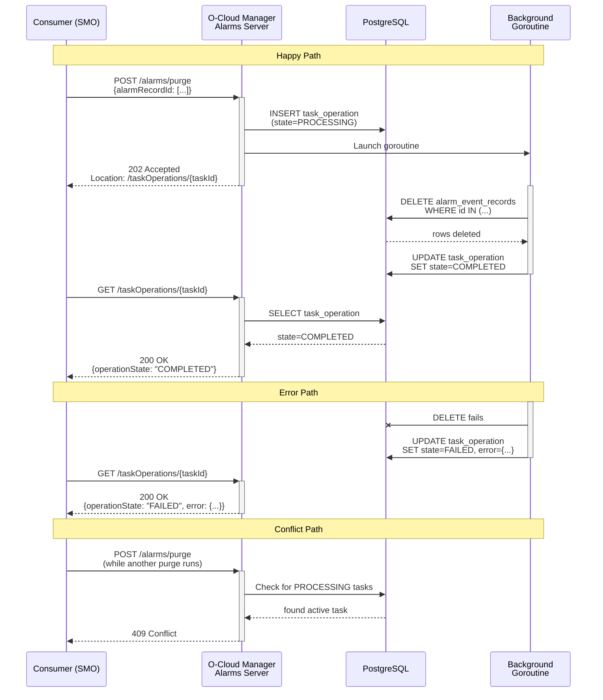
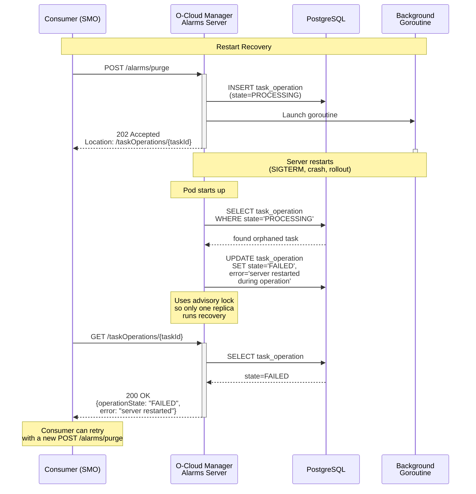

# O2IMS Interface v13 Alignment

```yaml
title: o2ims-v13
authors:
  - @rauherna
reviewers:
  - TBD
approvers:
  - TBD
creation-date: 2026-09-21
last-updated: 2026-09-25
```

**Epic**: [CNF-26925](https://redhat.atlassian.net/browse/CNF-26925)
**Spec**: O-RAN.WG6.TS.O2IMS-INTERFACE-R005-v13.00

---

## Table of Contents

- [1. Executive Summary](#1-executive-summary)
- [2. Previous v11 Implementation Reference](#2-previous-v11-implementation-reference)
- [3. Inventory Interface Analysis](#3-inventory-interface-analysis-o2ims_infrastructureinventory)
  - [3.1 API Version History](#31-api-version-history)
  - [3.2 Gap Assessment](#32-gap-assessment)
- [4. Provisioning Interface Analysis](#4-provisioning-interface-analysis-o2ims_infrastructureprovisioning)
  - [4.1 API Version History](#41-api-version-history)
  - [4.2 Gap Assessment](#42-gap-assessment)
- [5. Monitoring/Alarms Interface Analysis](#5-monitoringalarms-interface-analysis-o2ims_infrastructuremonitoring)
  - [5.1 API Version History](#51-api-version-history)
  - [5.2 Gap Assessment](#52-gap-assessment)
- [6. Phased Implementation](#6-phased-implementation)
- [7. Verification Plan](#7-verification-plan)
- [Appendix A: Spec Reference Mapping](#appendix-a-spec-reference-mapping)

---

## 1. Executive Summary

This document analyzes the changes required to align the O-Cloud Manager's O2 APIs
with v13 of the O-RAN O2IMS Interface specification. Three interfaces are in scope:
Inventory, Provisioning, and Monitoring (alarms).

**Key finding**: Inventory and Provisioning are already ~95–100% aligned with v13
thanks to the v11 PRs (#2187, #2322, #2369), which implemented draft CRs later
ratified in v13. **Monitoring/Alarms is the main work area**, requiring new endpoints,
data model changes, and a major API version bump (v1 → v2).

| Interface | Current API | v13 API |
|-----------|-------------|---------|
| Inventory | 2.0.0 | 2.0.0 |
| Provisioning | 1.2.0 | 1.2.0 |
| Monitoring | ~1.1.0 | 2.2.0 |

---

## 2. Previous v11 Implementation Reference

Our last spec alignment was to v11, implemented across three PRs:

| PR | Description |
|----|-------------|
| [#2187](https://github.com/openshift-kni/oran-o2ims/pull/2187) | Inventory phase 1 (non-breaking): new Location, OCloudSite, ResourcePool CRDs and controllers |
| [#2322](https://github.com/openshift-kni/oran-o2ims/pull/2322) | Inventory phase 2 (breaking): full service layer — DB, REST endpoints, collectors, HW plugin, new BMH labels |
| [#2369](https://github.com/openshift-kni/oran-o2ims/pull/2369) | Provisioning (non-breaking): status fields, response code changes, field renames |

---

## 3. Inventory Interface Analysis (O2ims_InfrastructureInventory)

### 3.1 API Version History

| API Version | Changes |
|-------------|---------|
| 1.0.0 | Initial — O-Cloud, ResourceType, ResourcePool, Resource, DeploymentManager, Subscriptions |
| 1.1.0 | Modified: InventorySubscriptionDescription; New: Performance/Alarm Dictionaries |
| 1.2.0 | Modified: ResourceTypeInfo (resourceKind, resourceClass) |
| **2.0.0** | **New: Location, O-Cloud Site endpoints. Modified: ResourcePoolInfo, CloudInfo** |

### 3.2 Gap Assessment

Functionally aligned. The v11 PRs implemented all v2.0.0 features ahead of
v13 ratification (Location, OCloudSite, ResourcePool endpoints, globalCloudId,
oCloudSiteId, notification support).

| # | v13 Requirement | Current | Action |
|---|-----------------|---------|--------|
| I-1 | OpenAPI spec references v13 | References v11 | Update `info` block |
| I-2 | Deprecated fields on ResourcePoolInfo | Absent | See below |

**I-2: Deprecated fields — conformance decision required.**

The v11 and v13 specs both mark `oCloudId` and `globalLocationId` on
ResourcePoolInfo as **mandatory but deprecated**. Our implementation dropped
them entirely when we introduced `oCloudSiteId` as the replacement.

> **Spec reference (Table 3.2.6.2.3-1, identical in v11 and v13):**
>
> | Attribute | Type | P | Card. | Notes |
> |-----------|------|---|-------|-------|
> | `resourcePoolId` | Identifier | M | 1 | |
> | `oCloudId` | Identifier | M | 1 | **Deprecated** — may be removed |
> | `globalLocationId` | Identifier | M | 1 | **Deprecated** — may be removed |
> | `name` | String | M | 1 | |
> | `oCloudSiteId` | Identifier | M | 1 | |
> | `description` | String | M | 1 | |
> | `location` | String | O | 0..1 | **Deprecated** — may be removed |
> | `extensions` | KeyValuePairs | O | 0..1 | |

Both values can be derived from existing data: `oCloudId` is the O-Cloud
instance identifier (already available at the server level), and
`globalLocationId` can be looked up from the OCloudSite record via
`resource_pool.o_cloud_site_id` → `o_cloud_site.global_location_id`.

| Option | What it means |
|--------|--------------|
| **Strict compliance** | Add both fields to the ResourcePool response as deprecated. Derivation is straightforward (~half a day). Full conformance with the mandatory cardinality. |
| **Pragmatic (current)** | Leave them absent. Our v2 API never served them, so no consumer expects them. Document the deviation. Risk: a strict conformance test would flag these as missing mandatory fields. |

---

## 4. Provisioning Interface Analysis (O2ims_InfrastructureProvisioning)

### 4.1 API Version History

| API Version | Changes |
|-------------|---------|
| 1.0.0 | Initial: ProvisioningRequest List + Description |
| 1.1.0 | Modified: ProvisioningRequestInfo |
| **1.2.0** | **Modified: ProvisionedResourceSet, ProvisioningStatus. New: ResourceProvisioningStatus** |

### 4.2 Gap Assessment

Functionally aligned. PR #2369 implemented all v1.2.0 changes
(ProvisionedResourceSet, ProvisioningStatus, ResourceProvisioningStatus type
and ResourceProvisioningPhase enum). Only documentation-level update remains.

| # | v13 Requirement | Current | Action |
|---|-----------------|---------|--------|
| P-1 | OpenAPI spec references v13 | References v11 | Update `info` block |

**Total provisioning changes: 1 item, documentation-level only.**

---

## 5. Monitoring/Alarms Interface Analysis (O2ims_InfrastructureMonitoring)

### 5.1 API Version History

| API Version | Changes |
|-------------|---------|
| 1.0.0 | Initial: Alarm Query, Subscription, Notification |
| 1.1.0 | New: Acknowledge, Clear, Service Config. Updated: Subscription |
| 1.2.0 | New: Purge Alarms Task, Task Operations. Updated: Notification, AlarmSubscription, AlarmEventRecord |
| 2.0.0 | Updated: Alarm Change Notification |
| 2.1.0 | Incremental updates |
| **2.2.0** | **New: Alarm Subscription Update (PATCH). Updated: AlarmSubscriptionInfo** |

Our current implementation references R003-v06.00 (June 2024) and is at roughly
API v1.1.0 level. We need to reach v2.2.0.

### 5.2 Gap Assessment

> **Note — Out of scope for this proposal:**
>
> - **Alarm dictionary taxonomy (Section 4)**: The standardized alarm definition
>   IDs (e.g., `CLUSTER_WARNING`) and probable cause mappings (e.g., `CPU_BUS`,
>   `NODE_DOWN`) are alarm-producer taxonomy concerns, not API contract changes.
>   `probableCauseId` remains unpopulated. Deferred to a follow-up effort.
> - **Performance dictionaries**: Our implementation derives everything from
>   Prometheus — alarms from PrometheusRules/AlertManager, and metrics go
>   directly through the Prometheus/Thanos stack without passing through the
>   O-Cloud Manager. The O-RAN spec envisions the O-Cloud exposing a performance
>   monitoring interface, but we don't implement
>   `O2ims_InfrastructurePerformanceMonitoring` at all. The performance dictionary
>   endpoints in the inventory API are just the catalog of "what can be measured,"
>   independent of the actual measurement delivery.

| # | Requirement | Since | Current | Action | Breaking? |
|---|-------------|-------|---------|--------|-----------|
| M-1 | `objectClass` on AlarmEventRecord | 2.0.0 | Not implemented | See [AlarmEventRecord](#alarmeventrecord), [DB: alarm_event_record](#db-schema-alarm_event_record-m-1-m-11) | Yes (when mandatory) |
| M-2 | `eventFilter` on AlarmSubscriptionInfo | 2.2.0 (v13) | Uses `filter` enum | See [AlarmSubscriptionInfo](#alarmsubscriptioninfo), [DB: alarm_subscription_info](#db-schema-alarm_subscription_info-m-2-m-12) | No |
| M-3 | PATCH `/alarmSubscriptions/{id}` | 2.2.0 (v13) | Not implemented | See [Missing Endpoints](#missing-endpoints), [AlarmSubscriptionUpdate](#alarmsubscriptionupdate-new-type) | No |
| M-4 | Purge Alarms Task (`POST /alarms/purge`) | 1.2.0 | Not implemented | See [Missing Endpoints](#missing-endpoints), [PurgeRequest](#purgerequest-new-type), [DB: task_operation](#db-schema-task_operation-m-4-m-5--new-table), [Async Workflow](#purge-alarms-async-workflow-m-4--m-5) | No |
| M-5 | Task Operations (list + get) | 1.2.0 | Not implemented | See [Missing Endpoints](#missing-endpoints), [TaskOperationInfo](#taskoperationinfo-new-type), [DB: task_operation](#db-schema-task_operation-m-4-m-5--new-table) | No |
| M-6 | `objectClass` on Alarm Change Notification | 2.0.0 | Not implemented | See [Alarm Change Notification](#alarm-change-notification) | No |
| M-7 | `objectRef` on Alarm Change Notification | 2.0.0 | Not implemented | See [Alarm Change Notification](#alarm-change-notification) | No |
| M-8 | `consumerSubscriptionId` in notification | 2.0.0 | Not in payload | See [Alarm Change Notification](#alarm-change-notification) | No |
| M-9 | API URL path v1 → v2 | 2.0.0 | Currently `/v1/` | Change to `/v2/`. See [Version Management](#version-management-m-9) | **Yes** |
| M-10 | OpenAPI spec references v13 | v13 | References R003-v06.00 | Update `info` block | No |
| M-11 | JSON field naming (5 fields) | 2.0.0 | Wrong names/casing | See [AlarmEventRecord](#alarmeventrecord), [Alarm Change Notification](#alarm-change-notification), [DB: alarm_event_record](#db-schema-alarm_event_record-m-1-m-11) | Yes (v2 wire format) |
| M-12 | `consumerSubscriptionId` UUID→String | Inherited | UUID-only | See [AlarmSubscriptionInfo](#alarmsubscriptioninfo), [DB: alarm_subscription_info](#db-schema-alarm_subscription_info-m-2-m-12) | No |

Only **M-4** and **M-5** involve the spec's async task model (202 +
TaskOperationOccurrence polling). The remaining gaps are standard
synchronous REST operations or notification pipeline changes.

#### Missing Endpoints

| Resource | URI | Method | Since | Action |
|----------|-----|--------|-------|--------|
| Purge Alarms Task | `/alarms/purge` | POST | 1.2.0 | New endpoint with true async (202 + task tracking) |
| Alarm Subscription Update | `/alarmSubscriptions/{id}` | PATCH | 2.2.0 (v13) | New method + `AlarmSubscriptionUpdate` body |
| Task Operation List | `/taskOperations` | GET | 1.2.0 | New endpoint (supports purge task polling) |
| Task Operation Occurrence | `/taskOperations/{id}` | GET | 1.2.0 | New endpoint (supports purge task polling) |

#### AlarmEventRecord

> **Spec reference (Table 3.3.6.2.2-1):** `objectClass` is type String,
> mandatory, cardinality 1. Described as: "The fully qualified name of the
> class of the object being referenced by the objectId attribute." The value
> is **free-form** — no controlled vocabulary or enumeration. Examples from
> the spec: `oran.o2ims.cluster.ClusterResource`,
> `oran.o2ims.cluster.NodeCluster`.

| Field | Change | Since |
|-------|--------|-------|
| `objectClass` | Add new mandatory field. Free-form string derived from resource type via infrastructure clients. | 2.0.0 |
| `objectTypeId` | Rename JSON key from `resourceTypeID` to `objectTypeId` | 2.0.0 |
| `objectId` | Rename JSON key from `resourceID` to `objectId` | 2.0.0 |
| `alarmDefinitionId` | Fix casing: `alarmDefinitionID` → `alarmDefinitionId` | 2.0.0 |
| `probableCauseId` | Fix casing: `probableCauseID` → `probableCauseId` | 2.0.0 |
| `alarmAcknowledgeTime` | Fix name: `alarmAcknowledgedTime` → `alarmAcknowledgeTime` | 2.0.0 |

#### AlarmSubscriptionInfo

| Field | Change | Since |
|-------|--------|-------|
| `eventFilter` | Add new enum field (NEW, CHANGE, CLEAR, ACKNOWLEDGE). Deprecate existing `filter`. | 2.2.0 (v13) |
| `consumerSubscriptionId` | Change type from UUID to String (spec allows arbitrary strings) | Inherited |

#### AlarmSubscriptionUpdate (new type)

> **Spec reference (Section 3.3.4.5.3.4, Table 3.3.4.5.3.4-2):** The PATCH
> method uses `Content-Type: application/merge-patch+json` (IETF RFC 7396).
> Fields not included in the request remain unmodified.
>
> | Response Code | Body | Description |
> |---------------|------|-------------|
> | 200 OK | AlarmSubscriptionInfo | Request accepted and completed. Response contains the updated subscription. |
> | 412 Precondition Failed | ProblemDetails | ETag mismatch — resource was modified by another entity. |
> | 4xx/5xx | ProblemDetails | Common error codes per ETSI GS NFV-SOL 013 clause 6.4. |

| Field | Type | Card. | Since |
|-------|------|-------|-------|
| `consumerSubscriptionId` | String | 0..1 | 2.2.0 (v13) |
| `eventFilter` | EventFilter | 0..1 | 2.2.0 (v13) |
| `callback` | Uri | 0..1 | 2.2.0 (v13) |

#### Alarm Change Notification

> **Spec reference (Table 3.3.5.1.2-1):** Complete v13 notification type
> sent via POST to the subscriber's callback URL:
>
> | Attribute | Type | P | Card. | Description |
> |-----------|------|---|-------|-------------|
> | `globalCloudId` | Identifier | M | 1 | Global cloud ID assigned by SMO |
> | `consumerSubscriptionId` | String | M | 0..1 | Consumer-provided subscription ID |
> | `notificationEventType` | Integer | M | 1 | 0=NEW, 1=CHANGE, 2=CLEAR, 3=ACKNOWLEDGE |
> | `objectRef` | String | M | 0..1 | URL to the AlarmEventRecord |
> | `alarmEventRecordId` | Identifier | M | 1 | Alarm record ID |
> | `objectTypeId` | Identifier | M | 1 | Type of object causing alarm |
> | `objectId` | Identifier | M | 1 | Instance of object causing alarm |
> | `objectClass` | String | M | 1 | Fully qualified class name (e.g., `oran.o2ims.cluster.ClusterResource`) |
> | `alarmDefinitionId` | Identifier | M | 1 | Alarm definition reference |
> | `probableCauseId` | Identifier | M | 1 | Probable cause reference |
> | `alarmRaisedTime` | DateTime | M | 1 | When raised |
> | `alarmChangedTime` | DateTime | M | 0..1 | When changed |
> | `alarmClearedTime` | DateTime | M | 0..1 | When cleared |
> | `alarmAcknowledgeTime` | DateTime | M | 0..1 | When acknowledged |
> | `alarmAcknowledged` | Boolean | M | 1 | Whether acknowledged |
> | `perceivedSeverity` | Integer | M | 1 | 0=CRITICAL, 1=MAJOR, 2=MINOR, 3=WARNING, 4=INDETERMINATE, 5=CLEARED |
> | `extensions` | KeyValue | M | 0..N | Vendor/operator extension properties |

Changes required from our current implementation:

| Field | Change | Since |
|-------|--------|-------|
| `objectClass` | Add new mandatory field | 2.0.0 |
| `objectRef` | Add URL to AlarmEventRecord | 2.0.0 |
| `consumerSubscriptionId` | Include from subscription record in notification payload | 2.0.0 |
| `objectTypeId` | Rename from `resourceTypeID` | 2.0.0 |
| `objectId` | Rename from `resourceID` | 2.0.0 |
| `alarmDefinitionId` | Fix casing from `alarmDefinitionID` | 2.0.0 |
| `probableCauseId` | Fix casing from `probableCauseID` | 2.0.0 |

#### PurgeRequest (new type)

| Field | Type | Card. | Since |
|-------|------|-------|-------|
| `alarmRecordId` | String | 0..N | 1.2.0 |
| `purgeConditions.startWindowTime` | DateTime | 0..1 | 1.2.0 |
| `purgeConditions.endWindowTime` | DateTime | 1 | 1.2.0 |

| Constraint | Detail |
|------------|--------|
| Input validation | At least one of `alarmRecordId` or `purgeConditions` must be provided |
| Response code | **202 Accepted** with empty body (SHALL — hard requirement per spec Section 3.3.4.7) |
| Response header | `Location` header pointing to the newly created Task Operation Occurrence |
| Conflict handling | 409 Conflict if another task operation is ongoing on the affected resources |
| Async execution | Handler returns 202 immediately. Purge runs in a background goroutine. Task record created as PROCESSING, updated to COMPLETED or FAILED on finish. |

#### TaskOperationInfo (new type)

| Field | Type | Card. | Since |
|-------|------|-------|-------|
| `id` | Identifier | 1 | 1.2.0 |
| `operationState` | Enum (PROCESSING, COMPLETED, FAILED, ROLLED_BACK) | 1 | 1.2.0 |
| `stateEnteredTime` | DateTime | 1 | 1.2.0 |
| `startTime` | DateTime | 1 | 1.2.0 |
| `operation` | Enum (PURGE) | 1 | 1.2.0 |
| `operationParams` | Object (PurgeRequest) | 0..1 | 1.2.0 |
| `error` | ProblemDetails | 0..1 | 1.2.0 |

#### DB Schema: alarm_event_record (M-1, M-11)

Add `object_class` column. Existing columns for reference:

| Column | Type | Nullable | Change |
|--------|------|----------|--------|
| `object_class` | VARCHAR | NO | **Add** — fully qualified class name |

Existing columns `resource_type_id`, `resource_id`, `alarm_definition_id`,
`probable_cause_id` remain unchanged in the DB — the JSON key renames (M-11)
are handled in the OpenAPI spec and serialization layer, not the schema.

#### DB Schema: alarm_subscription_info (M-2, M-12)

| Column | Type | Change |
|--------|------|--------|
| `event_filter` | VARCHAR | **Add** — enum (NEW, CHANGE, CLEAR, ACKNOWLEDGE) |
| `consumer_subscription_id` | VARCHAR → TEXT | **Keep as VARCHAR** (already text-compatible; remove UUID validation in OpenAPI/Go) |

#### DB Schema: task_operation (M-4, M-5) — new table

| Column | Type | Nullable | Notes |
|--------|------|----------|-------|
| `id` | UUID PK | NO | Task operation ID |
| `operation_state` | VARCHAR | NO | PROCESSING, COMPLETED, FAILED, ROLLED_BACK |
| `state_entered_time` | TIMESTAMPTZ | NO | When current state was entered |
| `start_time` | TIMESTAMPTZ | NO | When operation started |
| `operation` | VARCHAR | NO | Operation type (PURGE) |
| `operation_params` | JSONB | YES | Input params (PurgeRequest) |
| `error` | JSONB | YES | Error info if FAILED |

#### Version Management (M-9)

> **Spec reference (Section 3.1.8, Table 3.1.6.1.6-1):** The API producer
> SHALL support dedicated URIs for version information. The
> `ApiVersionInformation` type contains:
>
> | Attribute | Type | Card. | Description |
> |-----------|------|-------|-------------|
> | `uriPrefix` | String | 1 | URI prefix in the form `{apiRoot}/{apiName}/{apiMajorVersion}/` |
> | `apiVersions` | Structure | 1..N | Supported versions for this API |
> | `>version` | String | 1 | Version identifier (e.g., `2.2.0`) |
> | `>isDeprecated` | Boolean | 0..1 | Whether the version is deprecated |
> | `>retirementDate` | DateTime | 0..1 | When the deprecated version will be removed (required if isDeprecated=true) |
>
> A deprecated version is still supported but recommended not to be used.
> When a version is no longer supported, it does not appear in the response.
> The `Version` HTTP header field conveys the API version in responses.

#### Impacted Files

| File | Change | Req |
|------|--------|-----|
| `internal/service/alarms/api/openapi.yaml` | Add `objectClass`, `eventFilter`, PATCH method, purge/task endpoints, v2 paths, field renames | [M-1](#62-gap-assessment), [M-2](#62-gap-assessment), [M-3](#62-gap-assessment), [M-4](#62-gap-assessment), [M-5](#62-gap-assessment), [M-9](#62-gap-assessment), [M-11](#62-gap-assessment) |
| `internal/service/alarms/api/generated/alarms.generated.go` | Regenerated from OpenAPI | All |
| `internal/service/alarms/api/server.go` | New handlers: PatchSubscription, PurgeAlarms, ListTaskOperations, GetTaskOperation; update field handling | [M-1](#62-gap-assessment), [M-3](#62-gap-assessment), [M-4](#62-gap-assessment), [M-5](#62-gap-assessment) |
| `internal/service/alarms/internal/db/migrations/000002_*` | Add `object_class` column | [M-1](#62-gap-assessment) |
| `internal/service/alarms/internal/db/migrations/000003_*` | Add `event_filter` column | [M-2](#62-gap-assessment) |
| `internal/service/alarms/internal/db/migrations/` (new) | New `task_operation` table | [M-4](#62-gap-assessment), [M-5](#62-gap-assessment) |
| `internal/service/alarms/internal/db/models/alarm_event_record.go` | Add ObjectClass field | [M-1](#62-gap-assessment) |
| `internal/service/alarms/internal/db/models/alarm_subscription.go` | Add EventFilter field | [M-2](#62-gap-assessment) |
| `internal/service/alarms/internal/db/models/` (new) | New `task_operation.go` model | [M-4](#62-gap-assessment), [M-5](#62-gap-assessment) |
| `internal/service/alarms/internal/db/models/converters.go` | Update converters for new fields and v2 naming | [M-1](#62-gap-assessment), [M-11](#62-gap-assessment) |
| `internal/service/alarms/internal/db/repo/` | New queries: task operations, subscription update, purge | [M-2](#62-gap-assessment), [M-3](#62-gap-assessment), [M-4](#62-gap-assessment), [M-5](#62-gap-assessment) |
| `internal/alertmanager/converter.go` | Populate objectClass when creating records | [M-1](#62-gap-assessment) |
| `internal/service/alarms/internal/infrastructure/infrastructure.go` | Expose objectClass in client interface | [M-1](#62-gap-assessment) |
| `internal/service/alarms/internal/infrastructure/clusterserver.go` | Derive objectClass from resource type | [M-1](#62-gap-assessment) |
| `internal/service/alarms/internal/infrastructure/resourceserver.go` | Derive objectClass from resource type | [M-1](#62-gap-assessment) |
| `internal/service/alarms/internal/notifier_provider/` | Add objectClass, objectRef, consumerSubscriptionId to notification payload | [M-6](#62-gap-assessment), [M-7](#62-gap-assessment), [M-8](#62-gap-assessment) |
| `config/rbac/oran_o2ims_user_roles.yaml` | Update monitoring endpoint paths for v2 | [M-9](#62-gap-assessment) |
| `config/rbac/oran_o2ims_oauth_role_bindings.yaml` | Update monitoring bindings for v2 | [M-9](#62-gap-assessment) |
| `internal/service/alarms/cmd/serve.go` | Update base path if hardcoded | [M-9](#62-gap-assessment) |

#### Purge Alarms Async Workflow (M-4 / M-5)

The diagrams below show the four flows for the purge operation:

1. **Happy path**: POST creates a task (PROCESSING), returns 202 immediately,
   background goroutine purges records and marks task COMPLETED, consumer
   polls and sees success.
2. **Error path**: Purge fails mid-execution, task is marked FAILED with a
   ProblemDetails error body. Consumer polls and sees the failure reason.
3. **Conflict path**: A second purge is requested while one is already
   PROCESSING. Server returns 409 per spec Section 3.3.4.7.
4. **Restart recovery**: The server restarts while a purge goroutine is
   running. On startup, orphaned PROCESSING tasks are transitioned to FAILED.
   The consumer sees the failure and can retry.

**Figure 1: Happy path, error path, and conflict path**



**Figure 2: Restart recovery**



> **Note on advisory locks:** The startup recovery uses a PostgreSQL advisory
> lock (`pg_try_advisory_xact_lock`) to ensure only one replica runs the
> recovery check when multiple pods start simultaneously (e.g., during a
> rollout). This is the same pattern already used by the resolved alarm
> cleanup in `alarms_repository.go:DeleteResolvedAlarmEventsBefore` — a
> non-blocking, transaction-scoped lock that is automatically released when
> the transaction ends.

---

## 6. Phased Implementation

### Overview

This feature is implemented in three phases to minimize disruption. Each phase
is delivered as a single, self-contained pull request containing only the logic
for that phase (3 PRs in total).

No v13 changes are **GitOps-breaking** — there are no new CRDs or user-facing
configuration changes. All breaking changes are **REST API consumer-facing**
(SMO-side), affecting the monitoring interface URL path.

### PR Summary

| PR | Title | Type | Interface |
|----|-------|------|-----------|
| PR 1 | Inventory + Provisioning spec alignment | Non-breaking | Inventory, Provisioning |
| PR 2 | Monitoring non-breaking additions | Non-breaking | Monitoring |
| PR 3 | Monitoring v2 breaking changes | Breaking (API consumers) | Monitoring |

### PR 1: Inventory + Provisioning Spec Alignment

| Item | Change |
|------|--------|
| OpenAPI spec info blocks | Update to reference v13 in resources and provisioning specs |
| Deprecated-field deviation | Document in inventory docs that legacy 1.x fields are absent |
| User-guide docs | Update `inventory-api.md` and `cluster-provisioning.md` |

### PR 2: Monitoring Non-Breaking Additions

Add new fields and endpoints while keeping the v1 API path:

| Item | Change |
|------|--------|
| `objectClass` on AlarmEventRecord | Add as optional initially (verify population logic before making mandatory) |
| `eventFilter` on AlarmSubscriptionInfo | Add alongside existing `filter` |
| PATCH `/alarmSubscriptions/{id}` | New method + `AlarmSubscriptionUpdate` type |
| Alarm Change Notification | Add `objectRef`, `objectClass`, `consumerSubscriptionId` |
| Purge Alarms Task | New `POST /alarms/purge` endpoint with true async: 202 immediate return, background goroutine executes purge, task record transitions PROCESSING → COMPLETED/FAILED |
| Task Operations | New `GET /taskOperations` and `GET /taskOperations/{id}` endpoints + DB table |
| DB migrations | New columns (`object_class`, `event_filter`) + new `task_operation` table |
| Test coverage | Unit, envtest, server tests for all new endpoints and fields |

### PR 3: Monitoring v2 Breaking Changes

| Item | Change |
|------|--------|
| API URL path | Bump from `/v1/` to `/v2/` |
| `objectClass` | Make mandatory on AlarmEventRecord |
| `filter` deprecation | Deprecate in favor of `eventFilter` |
| RBAC roles | Update monitoring endpoint paths in `oran_o2ims_user_roles.yaml` |
| OAuth bindings | Update monitoring bindings in `oran_o2ims_oauth_role_bindings.yaml` |
| OpenAPI spec version | Update to reference v13 |
| Docs | Update monitoring-related documentation |

### Ordering Rationale

| Order | Reason |
|-------|--------|
| Inventory/Provisioning first | Trivial changes; clears the backlog early |
| Monitoring non-breaking before breaking | New fields/endpoints are available before the URL path changes. `objectClass` population is verified before making it mandatory. Consumers can adopt `eventFilter` and PATCH while still on v1. |
| Breaking changes last | Clean cutover after all features are in place |

---

## 7. Verification Plan

### Per-PR Build Verification

| Check | Command | When to Run |
|-------|---------|-------------|
| Code generation | `make generate && make manifests && make bundle` | After API/CRD changes |
| Full CI pipeline | `make ci-job` | Every PR (format, vet, lint, test, envtest, coverage, bundle-check) |
| End-to-end tests | `make test-e2e` | Changes touching alarm flows or controller logic |
| Go lint | `make golangci-lint` | Go file changes |
| YAML lint | `make yamllint` | OpenAPI spec changes |
| Markdown lint | `make markdownlint` | Documentation changes |

### Functional Verification (Monitoring)

| Test | Description |
|------|-------------|
| PATCH subscription | Update callback, eventFilter, consumerSubscriptionId via PATCH |
| objectClass in records | Verify objectClass appears in alarm event records after creation |
| objectClass in notifications | Verify objectClass in Alarm Change Notification payload |
| Purge by ID | POST `/alarms/purge` with alarm record IDs, verify 202 + Location |
| Purge by time window | POST `/alarms/purge` with purgeConditions, verify records removed |
| Task operations | GET task operation shows COMPLETED after purge |
| eventFilter subscription | Create subscription with eventFilter, verify filtering works |
| Deprecated filter | Existing `filter` field still works alongside `eventFilter` |
| v2 URL path | All endpoints accessible under `/v2/` after bump |
| Existing flows | Alarm create, acknowledge, clear unaffected by changes |
| RBAC | Verify monitoring roles grant access to v2 paths |

---

## Appendix A: Spec Reference Mapping

| Spec Section | Content | Relevance |
|--------------|---------|-----------|
| 3.1.7 | Security (OAuth scope verification) | RBAC changes when paths move to v2 (M-9) |
| 3.1.8 | Version management | v1/v2 coexistence and API version discovery (M-9) |
| 3.2 | Inventory API definition | Endpoints, data model, notifications |
| 3.2.2 (Table 3.2.2-1) | Inventory API version history | v1.0.0 → v2.0.0 changes |
| 3.2.3 (Table 3.2.3-1) | Inventory REST resources and methods | Mandatory endpoints including performance dictionaries (I-2, out-of-scope note) |
| 3.2.6.2.3 | ResourcePoolInfo type | Deprecated fields: oCloudId, globalLocationId (I-2) |
| 3.3 | Monitoring API definition | Endpoints, data model, notifications |
| 3.3.2 (Table 3.3.2-1) | Monitoring API version history | v1.0.0 → v2.2.0 changes |
| 3.3.3 (Table 3.3.3-1) | Monitoring REST resources and methods | Mandatory endpoints table (M-3, M-4, M-5) |
| 3.3.4.5 | Alarm Subscription Description | PATCH method (M-3, p106-107) |
| 3.3.4.7 | Purge Alarms Task | POST 202 Accepted (M-4, p110-111) |
| 3.3.4.8 | Task Operation List | GET collection (M-5, p112-114) |
| 3.3.4.9 | Task Operation Occurrence | GET individual task (M-5, p115-116) |
| 3.3.5 | Alarm Change Notification | objectClass, objectRef, consumerSubscriptionId in notification (M-6, M-7, M-8) |
| 3.3.6.2.2 | AlarmEventRecord type | objectClass field (M-1) |
| 3.3.6.2.3 | AlarmSubscriptionInfo type | eventFilter field (M-2) |
| 3.3.6.2.6 | PurgeRequest type | Purge input: alarmRecordId, purgeConditions (M-4) |
| 3.3.6.2.7 | TaskOperationInfo type | Task state, operation, error (M-4, M-5) |
| 3.3.6.2.8 | AlarmSubscriptionUpdate type | PATCH body (M-3) |
| 3.3.6.3.3.1 | EventFilter enumeration | NEW, CHANGE, CLEAR, ACKNOWLEDGE (M-2) |
| 3.4 | Provisioning API definition | Endpoints, data model |
| 3.4.2 (Table 3.4.2-1) | Provisioning API version history | v1.0.0 → v1.2.0 changes |
| 4 | O-Cloud Alarms dictionary | Out of scope for this feature |
| Annex (Change History) | CR list v11→v13 | Traceability |
