# Server Onboarding

This guide describes how to define the geographic and organizational hierarchy for your O-Cloud infrastructure using Custom Resources (CRs), and how to associate BareMetalHost (BMH) resources with this hierarchy.

- [Overview](#overview)
- [Data Model Relationships](#data-model-relationships)
- [Step 1: Create Location CRs](#step-1-create-location-crs)
- [Step 2: Create OCloudSite CRs](#step-2-create-ocloudsite-crs)
- [Step 3: Create ResourcePool CRs](#step-3-create-resourcepool-crs)
- [Step 4: Label BareMetalHost Resources](#step-4-label-baremetalhost-resources)
- [Validation](#validation)
- [Example: Complete Hierarchy](#example-complete-hierarchy)

## Overview

The O-Cloud infrastructure hierarchy consists of four levels:

```text
Location (geographic place)
    └── OCloudSite (logical site at a location)
            └── ResourcePool (group of resources)
                    └── Resource (BareMetalHost/server)
```

Each level is defined by a Custom Resource (CR) in the hub cluster, except for Resources which are discovered from BareMetalHost CRs via labels.

## Data Model Relationships

The following diagram shows how the CRs relate to each other through their fields:



### Key Relationships

| Source CR | Field | References | Target CR Field |
|-----------|-------|------------|-----------------|
| OCloudSite | `spec.globalLocationId` | → | Location `spec.globalLocationId` |
| ResourcePool | `spec.oCloudSiteId` | → | OCloudSite `spec.siteId` |
| BareMetalHost | label `siteId` | → | OCloudSite `spec.siteId` |
| BareMetalHost | label `resourcePoolId` | → | ResourcePool `spec.resourcePoolId` |

> :warning: **Important**: These relationships are enforced by string matching. Ensure the referenced values exist and match exactly.

## Step 1: Create Location CRs

Locations represent physical or logical places where O-Cloud Sites can be deployed.

```yaml
apiVersion: ocloud.openshift.io/v1alpha1
kind: Location
metadata:
  name: east-datacenter
  namespace: oran-o2ims
spec:
  # PRIMARY KEY - must be unique across all Locations
  globalLocationId: "LOC-EAST-001"
  
  name: "East Data Center"
  description: "Primary east coast data center facility"
  
  # At least ONE of: coordinate, civicAddress, or address is required
  coordinate:
    latitude: "38.8951"
    longitude: "-77.0364"
    altitude: "100.5"  # optional
  
  civicAddress:
    - caType: 1    # Country (ISO 3166-1)
      caValue: "US"
    - caType: 3    # State/Province
      caValue: "Virginia"
    - caType: 6    # City
      caValue: "Ashburn"
    - caType: 22   # Street name
      caValue: "Technology Way"
    - caType: 26   # Building number
      caValue: "123"
  
  address: "123 Technology Way, Ashburn, VA 20147, USA"
  
  extensions:
    region: "us-east"
    tier: "primary"
```

### Location Field Reference

| Field | Required | Description |
|-------|----------|-------------|
| `globalLocationId` | Yes | Unique identifier (string). Used as primary key in database. |
| `name` | Yes | Human-readable name |
| `description` | Yes | Detailed description |
| `coordinate` | One of three | GeoJSON-compatible coordinates |
| `civicAddress` | One of three | RFC 4776 civic address elements |
| `address` | One of three | Human-readable address string |
| `extensions` | No | Custom key-value metadata |

Apply the Location CR:

```bash
kubectl apply -f location-east.yaml
```

## Step 2: Create OCloudSite CRs

O-Cloud Sites represent logical groupings of infrastructure at a Location.

```yaml
apiVersion: ocloud.openshift.io/v1alpha1
kind: OCloudSite
metadata:
  name: site-east-1
  namespace: oran-o2ims
spec:
  # This value is used for BMH label matching and UUID generation
  siteId: "SITE-EAST-001"
  
  # MUST MATCH an existing Location's globalLocationId
  globalLocationId: "LOC-EAST-001"
  
  name: "East Site 1"
  description: "Primary compute site at east data center"
  
  extensions:
    environment: "production"
    managed-by: "team-infra"
```

### OCloudSite Field Reference

| Field | Required | Description |
|-------|----------|-------------|
| `siteId` | Yes | String identifier. Used to match BMH labels and generate UUID. |
| `globalLocationId` | Yes | **Must match** an existing `Location.spec.globalLocationId` |
| `name` | Yes | Human-readable name |
| `description` | Yes | Detailed description |
| `extensions` | No | Custom key-value metadata |

Apply the OCloudSite CR:

```bash
kubectl apply -f ocloudsite-east-1.yaml
```

## Step 3: Create ResourcePool CRs

Resource Pools group related resources (servers) within an O-Cloud Site.

```yaml
apiVersion: ocloud.openshift.io/v1alpha1
kind: ResourcePool
metadata:
  name: pool-east-compute
  namespace: oran-o2ims
spec:
  # This value is used for BMH label matching and UUID generation
  resourcePoolId: "pool-east-compute"
  
  # MUST MATCH an existing OCloudSite's siteId
  oCloudSiteId: "SITE-EAST-001"
  
  name: "East Compute Pool"
  description: "Compute resources for production workloads"
  
  # Optional: deprecated, use oCloudSiteId instead
  location: "US-EAST"
  
  extensions:
    hardware-profile: "high-performance"
    purpose: "ran-du"
```

### ResourcePool Field Reference

| Field | Required | Description |
|-------|----------|-------------|
| `resourcePoolId` | Yes | String identifier. Used to match BMH labels and generate UUID. |
| `oCloudSiteId` | Yes | **Must match** an existing `OCloudSite.spec.siteId` |
| `name` | Yes | Human-readable name |
| `description` | Yes | Detailed description |
| `location` | No | Deprecated. Simple location string. |
| `extensions` | No | Custom key-value metadata |

Apply the ResourcePool CR:

```bash
kubectl apply -f resourcepool-east-compute.yaml
```

## Step 4: Label BareMetalHost Resources

BareMetalHost (BMH) resources are associated with the hierarchy via labels:

```yaml
apiVersion: metal3.io/v1alpha1
kind: BareMetalHost
metadata:
  name: server-001
  namespace: dell-r740-pool
  labels:
    # MUST MATCH an existing OCloudSite's siteId
    resources.clcm.openshift.io/siteId: "SITE-EAST-001"
    
    # MUST MATCH an existing ResourcePool's resourcePoolId
    resources.clcm.openshift.io/resourcePoolId: "pool-east-compute"
    
    # Additional selection labels
    resourceselector.clcm.openshift.io/server-type: "R740"
    resourceselector.clcm.openshift.io/server-id: "server-001"
  annotations:
    resourceinfo.clcm.openshift.io/description: "Dell R740 server for RAN DU"
spec:
  online: false
  bmc:
    address: idrac-virtualmedia+https://192.168.1.10/redfish/v1/Systems/System.Embedded.1
    credentialsName: bmc-secret-server-001
    disableCertificateVerification: true
  bootMACAddress: "02:00:00:00:00:01"
```

### Required Labels

| Label | Required | Description |
|-------|----------|-------------|
| `resources.clcm.openshift.io/siteId` | Yes | **Must match** an existing `OCloudSite.spec.siteId` |
| `resources.clcm.openshift.io/resourcePoolId` | Yes | **Must match** an existing `ResourcePool.spec.resourcePoolId` |

## Validation

After creating the CRs, verify the hierarchy is correct:

### Check Locations

```bash
$ kubectl get locations -n oran-o2ims
NAME              GLOBALLOCATIONID   NAME                AGE
east-datacenter   LOC-EAST-001       East Data Center    5m
```

### Check O-Cloud Sites

```bash
$ kubectl get ocloudsites -n oran-o2ims
NAME          SITEID          LOCATIONID     NAME          AGE
site-east-1   SITE-EAST-001   LOC-EAST-001   East Site 1   4m
```

### Check Resource Pools

```bash
$ kubectl get resourcepools -n oran-o2ims
NAME                POOLID               SITEID          NAME                AGE
pool-east-compute   pool-east-compute    SITE-EAST-001   East Compute Pool   3m
```

### Verify via API

After the collector processes the CRs (watch-based, so nearly immediate), verify via the Inventory API:

```bash
# Get Locations
$ curl -ks --header "Authorization: Bearer ${MY_TOKEN}" \
  "https://${API_URI}/o2ims-infrastructureInventory/v1/locations" | jq

# Get O-Cloud Sites
$ curl -ks --header "Authorization: Bearer ${MY_TOKEN}" \
  "https://${API_URI}/o2ims-infrastructureInventory/v1/oCloudSites" | jq

# Get Resource Pools
$ curl -ks --header "Authorization: Bearer ${MY_TOKEN}" \
  "https://${API_URI}/o2ims-infrastructureInventory/v1/resourcePools" | jq
```

## Example: Complete Hierarchy

Here's a complete example showing all CRs for a typical deployment:

```yaml
---
# 1. Location
apiVersion: ocloud.openshift.io/v1alpha1
kind: Location
metadata:
  name: east-datacenter
  namespace: oran-o2ims
spec:
  globalLocationId: "LOC-EAST-001"
  name: "East Data Center"
  description: "Primary east coast facility"
  address: "123 Technology Way, Ashburn, VA"
---
# 2. O-Cloud Site (references Location)
apiVersion: ocloud.openshift.io/v1alpha1
kind: OCloudSite
metadata:
  name: site-east-1
  namespace: oran-o2ims
spec:
  siteId: "SITE-EAST-001"
  globalLocationId: "LOC-EAST-001"  # ◄── Must match Location above
  name: "East Site 1"
  description: "Primary compute site"
---
# 3. Resource Pool (references OCloudSite)
apiVersion: ocloud.openshift.io/v1alpha1
kind: ResourcePool
metadata:
  name: pool-east-compute
  namespace: oran-o2ims
spec:
  resourcePoolId: "pool-east-compute"
  oCloudSiteId: "SITE-EAST-001"     # ◄── Must match OCloudSite.siteId above
  name: "East Compute Pool"
  description: "Compute resources"
---
# 4. BareMetalHost (references OCloudSite and ResourcePool via labels)
apiVersion: metal3.io/v1alpha1
kind: BareMetalHost
metadata:
  name: server-001
  namespace: dell-r740-pool
  labels:
    resources.clcm.openshift.io/siteId: "SITE-EAST-001"           # ◄── OCloudSite
    resources.clcm.openshift.io/resourcePoolId: "pool-east-compute" # ◄── ResourcePool
spec:
  online: false
  bmc:
    address: idrac-virtualmedia+https://192.168.1.10/redfish/v1/Systems/System.Embedded.1
    credentialsName: bmc-secret
    disableCertificateVerification: true
  bootMACAddress: "02:00:00:00:00:01"
```

Apply all resources:

```bash
kubectl apply -f complete-hierarchy.yaml
```
