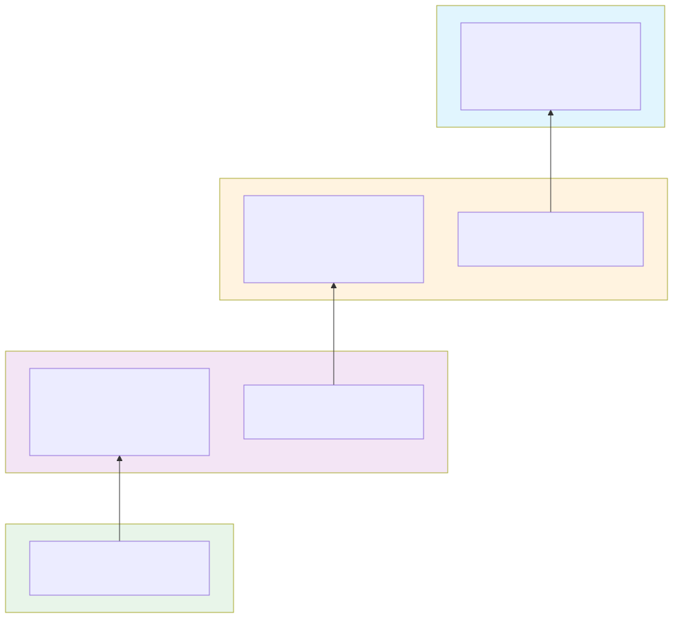

# Server Onboarding

This guide describes how to define the geographic and organizational hierarchy for your O-Cloud infrastructure using Custom Resources (CRs), and how to associate BareMetalHost (BMH) resources with this hierarchy.

- [Overview](#overview)
- [Data Model Relationships](#data-model-relationships)
- [Step 1: Create Location CRs](#step-1-create-location-crs)
- [Step 2: Create OCloudSite CRs](#step-2-create-ocloudsite-crs)
- [Step 3: Create ResourcePool CRs](#step-3-create-resourcepool-crs)
- [Step 4: Label BareMetalHost Resources](#step-4-label-baremetalhost-resources)
- [Validation](#validation)
  - [Check BMH Provisioning State](#check-bmh-provisioning-state)
- [Example: Complete Hierarchy](#example-complete-hierarchy)
- [Deleting CRs](#deleting-crs)

## Overview

The O-Cloud infrastructure hierarchy consists of four levels:

```text
Location (geographic place)
    └── OCloudSite (logical site at a location)
            └── ResourcePool (group of resources)
                    └── Resource (BareMetalHost/server)
```

Each level is defined by a Custom Resource (CR) in the hub cluster, except for Resources which are discovered from BareMetalHost CRs via labels.

## Data Model Relationships

The following diagram shows how the CRs relate to each other through their fields:



### Key Relationships

| Source CR | Field | Target CR Field |
|-----------|-------|-----------------|
| OCloudSite | `spec.globalLocationName` | Location `metadata.name` |
| ResourcePool | `spec.oCloudSiteName` | OCloudSite `metadata.name` |
| BareMetalHost | label `resourcePoolName` | ResourcePool `metadata.name` |

### Identifiers in API Responses

| CR Type | CR Identifier | API Response Identifier |
|---------|---------------|------------------------|
| Location | `metadata.name` | `globalLocationId` = `metadata.name` (string) |
| OCloudSite | `metadata.name` | `oCloudSiteId` = `metadata.uid` (UUID) |
| ResourcePool | `metadata.name` | `resourcePoolId` = `metadata.uid` (UUID) |

## Step 1: Create Location CRs

Locations represent physical or logical places where O-Cloud Sites can be deployed.

```yaml
apiVersion: ocloud.openshift.io/v1alpha1
kind: Location
metadata:
  # The name serves as the globalLocationId in API responses
  name: east-datacenter
  namespace: oran-o2ims
spec:
  description: "Primary east coast data center facility"

  # At least ONE of: coordinate, civicAddress, or address is required
  coordinate:
    latitude: "38.8951"
    longitude: "-77.0364"
    altitude: "100.5"  # optional

  civicAddress:
    - caType: 1    # Country (ISO 3166-1)
      caValue: "US"
    - caType: 3    # State/Province
      caValue: "Virginia"
    - caType: 6    # City
      caValue: "Ashburn"
    - caType: 22   # Street name
      caValue: "Technology Way"
    - caType: 26   # Building number
      caValue: "123"

  address: "123 Technology Way, Ashburn, VA 20147, USA"

  extensions:
    region: "us-east"
    tier: "primary"
```

### Location Field Reference

| Field | Required | Description |
|-------|----------|-------------|
| `metadata.name` | Yes | Used as `globalLocationId` in API responses. Must be unique. |
| `description` | No | Detailed description |
| `coordinate` | One of three | GeoJSON-compatible coordinates |
| `civicAddress` | One of three | RFC 4776 civic address elements |
| `address` | One of three | Human-readable address string |
| `extensions` | No | Custom key-value metadata |

Apply the Location CR:

```bash
oc apply -f location-east.yaml
```

## Step 2: Create OCloudSite CRs

O-Cloud Sites represent logical groupings of infrastructure at a Location.

```yaml
apiVersion: ocloud.openshift.io/v1alpha1
kind: OCloudSite
metadata:
  # name is used for references from ResourcePool CRs
  # metadata.uid becomes oCloudSiteId in API responses
  name: site-east-1
  namespace: oran-o2ims
spec:
  # MUST MATCH an existing Location's metadata.name
  globalLocationName: "east-datacenter"
  description: "Primary compute site at east data center"

  extensions:
    environment: "production"
    managed-by: "team-infra"
```

### OCloudSite Field Reference

| Field | Required | Description |
|-------|----------|-------------|
| `metadata.name` | Yes | Used for references from ResourcePool CRs. Must be unique. |
| `globalLocationName` | Yes | **Must match** an existing Location's `metadata.name` |
| `description` | No | Detailed description |
| `extensions` | No | Custom key-value metadata |

Apply the OCloudSite CR:

```bash
oc apply -f ocloudsite-east-1.yaml
```

## Step 3: Create ResourcePool CRs

Resource Pools group related resources (servers) within an O-Cloud Site.

```yaml
apiVersion: ocloud.openshift.io/v1alpha1
kind: ResourcePool
metadata:
  # name is used for BMH label matching
  # metadata.uid becomes resourcePoolId in API responses
  name: pool-east-compute
  namespace: oran-o2ims
spec:
  # MUST MATCH an existing OCloudSite's metadata.name
  oCloudSiteName: "site-east-1"
  description: "Compute resources for production workloads"

  extensions:
    hardware-profile: "high-performance"
    purpose: "ran-du"
```

### ResourcePool Field Reference

| Field | Required | Description |
|-------|----------|-------------|
| `metadata.name` | Yes | Used for BMH label matching. Must be unique. |
| `oCloudSiteName` | Yes | **Must match** an existing OCloudSite's `metadata.name` |
| `description` | No | Detailed description |
| `extensions` | No | Custom key-value metadata |

Apply the ResourcePool CR:

```bash
oc apply -f resourcepool-east-compute.yaml
```

## Step 4: Label BareMetalHost Resources

BareMetalHost (BMH) resources are associated with the hierarchy via labels:

```yaml
apiVersion: metal3.io/v1alpha1
kind: BareMetalHost
metadata:
  name: server-001
  namespace: dell-r740-pool
  labels:
    # MUST MATCH an existing ResourcePool's metadata.name
    resources.clcm.openshift.io/resourcePoolName: "pool-east-compute"

    # Additional selection labels
    resourceselector.clcm.openshift.io/server-type: "R740"
    resourceselector.clcm.openshift.io/server-id: "server-001"
  annotations:
    resourceinfo.clcm.openshift.io/description: "Dell R740 server for RAN DU"
spec:
  online: false
  bmc:
    address: idrac-virtualmedia+https://192.168.1.10/redfish/v1/Systems/System.Embedded.1
    credentialsName: bmc-secret-server-001
    disableCertificateVerification: true
  bootMACAddress: "02:00:00:00:00:01"
```

### Required Labels

| Label | Required | Description |
|-------|----------|-------------|
| `resources.clcm.openshift.io/resourcePoolName` | Yes | **Must match** an existing ResourcePool's `metadata.name` |

> **Note**: The BMH is linked to the hierarchy through the ResourcePool. The OCloudSite and Location are determined by navigating up the hierarchy from the ResourcePool.

## Validation

After creating the CRs, verify the hierarchy is correct:

### Check Locations

```bash
$ oc get locations -n oran-o2ims
NAME              READY   AGE
east-datacenter   True    5m
```

### Check O-Cloud Sites

```bash
$ oc get ocloudsites -n oran-o2ims
NAME          LOCATION          READY   AGE
site-east-1   east-datacenter   True    4m
```

### Check Resource Pools

```bash
$ oc get resourcepools -n oran-o2ims
NAME                SITE          READY   AGE
pool-east-compute   site-east-1   True    3m
```

### Check BareMetalHosts

Verify that your BareMetalHosts have the required label to associate them with a ResourcePool:

```bash
# Check if BMHs have the resourcePoolName label
$ oc get baremetalhosts -A -o custom-columns=\
'NAMESPACE:.metadata.namespace,NAME:.metadata.name,POOL:.metadata.labels.resources\.clcm\.openshift\.io/resourcePoolName'
NAMESPACE        NAME          POOL
dell-r740-pool   server-001    pool-east-compute
dell-r740-pool   server-002    pool-east-compute
```

If the `POOL` column is empty (`<none>`), the BMH won't appear in the Resources API.
Add the label to associate a BMH with a ResourcePool:

```bash
$ oc label baremetalhost server-001 -n dell-r740-pool \
  resources.clcm.openshift.io/resourcePoolName=pool-east-compute
```

You can also list BMHs belonging to a specific ResourcePool:

```bash
oc get baremetalhosts -A -l resources.clcm.openshift.io/resourcePoolName=pool-east-compute
```

### Check BMH Provisioning State

BareMetalHosts must be in certain provisioning states to appear in the Resources API.
The hardware plugin only includes BMHs that have progressed through initial registration:

```bash
# Check BMH provisioning state
$ oc get baremetalhosts -A -o custom-columns=\
'NAMESPACE:.metadata.namespace,NAME:.metadata.name,STATE:.status.provisioning.state'
NAMESPACE        NAME          STATE
dell-r740-pool   server-001    available
dell-r740-pool   server-002    provisioned
```

**Valid states for inventory inclusion:**

| State | Description |
|-------|-------------|
| `available` | BMH is registered and ready for provisioning |
| `provisioned` | BMH has been provisioned with an OS |
| `provisioning` | BMH is currently being provisioned |
| `deprovisioning` | BMH is being returned to available state |
| `externally provisioned` | BMH was provisioned outside Metal3 |

If a BMH has the correct `resourcePoolName` label but doesn't appear in the Resources API,
check its provisioning state. BMHs in early lifecycle states (registering, inspecting)
will appear once they reach the `available` state.

### Verify via API

After the collector processes the CRs, verify via the Inventory API.

> **Important**: Data collection timing differs by resource type:
>
> | Resource Type | Collection Method | Timing |
> |---------------|-------------------|--------|
> | Locations, OCloudSites, ResourcePools | Watch-based | Nearly immediate |
> | Resources (BareMetalHosts) | Polling-based | Up to 1 minute (default interval) |
>
> The Resources endpoint data comes from the hardware plugin, which is polled every minute.
> If a newly labeled BMH doesn't appear immediately, wait for the next polling cycle.

First, set up authentication (see [Testing API endpoints](environment-setup.md#testing-api-endpoints-on-a-cluster) for details):

```bash
# For development testing, use a Service Account token
oc apply -f config/testing/client-service-account-rbac.yaml
export MY_TOKEN=$(oc create token -n oran-o2ims test-client --duration=24h)

# Get the API URI from any route (all O2IMS routes share the same host)
export API_URI=$(oc get routes -n oran-o2ims -o jsonpath='{.items[0].spec.host}')
```

> **Note**: The O2IMS operator creates multiple routes that share the same hostname but use
> different path prefixes to route to different backend services:
>
> | Path Prefix | Backend Service | Purpose |
> |-------------|-----------------|---------|
> | `/o2ims-infrastructureInventory` | resource-server | Locations, Sites, Pools, Resources |
> | `/o2ims-infrastructureCluster` | cluster-server | Cluster templates, deployments |
> | `/o2ims-infrastructureProvisioning` | provisioning-server | Provisioning requests |
> | `/o2ims-infrastructureMonitoring` | alarms-server | Alarms and alarm definitions |
> | `/o2ims-infrastructureArtifacts` | artifacts-server | Artifact management |

Then query the API:

```bash
# Get Locations
$ curl -ks --header "Authorization: Bearer ${MY_TOKEN}" \
  "https://${API_URI}/o2ims-infrastructureInventory/v1/locations" | jq
[
  {
    "address": "123 Technology Way, Ashburn, VA",
    "description": "Primary east coast facility",
    "extensions": {},
    "globalLocationId": "east-datacenter",
    "name": "east-datacenter",
    "oCloudSiteIds": [
      "fddfbbae-0fb3-402e-8408-6adbb6ba382a"
    ]
  }
]

# Get O-Cloud Sites
$ curl -ks --header "Authorization: Bearer ${MY_TOKEN}" \
  "https://${API_URI}/o2ims-infrastructureInventory/v1/oCloudSites" | jq
[
  {
    "description": "Primary compute site",
    "extensions": {},
    "globalLocationId": "east-datacenter",
    "name": "site-east-1",
    "oCloudSiteId": "fddfbbae-0fb3-402e-8408-6adbb6ba382a",
    "resourcePools": [
      "7067f73f-2e62-47ca-8a31-6264f97f8cdc"
    ]
  }
]

# Get Resource Pools
$ curl -ks --header "Authorization: Bearer ${MY_TOKEN}" \
  "https://${API_URI}/o2ims-infrastructureInventory/v1/resourcePools" | jq
[
  {
    "description": "Compute resources",
    "extensions": {},
    "name": "pool-east-compute",
    "oCloudSiteId": "fddfbbae-0fb3-402e-8408-6adbb6ba382a",
    "resourcePoolId": "7067f73f-2e62-47ca-8a31-6264f97f8cdc"
  }
]

# Get Resources within a Resource Pool (BareMetalHosts)
# Replace {resourcePoolId} with the actual UUID from the previous response
$ curl -ks --header "Authorization: Bearer ${MY_TOKEN}" \
  "https://${API_URI}/o2ims-infrastructureInventory/v1/resourcePools/7067f73f-2e62-47ca-8a31-6264f97f8cdc/resources" | jq
[
  {
    "resourceId": "a1b2c3d4-e5f6-7890-abcd-ef1234567890",
    "resourcePoolId": "7067f73f-2e62-47ca-8a31-6264f97f8cdc",
    "description": "Dell PowerEdge R740",
    "resourceTypeId": "d1eabf91-f0e6-5170-97dc-797d35146dad",
    "globalAssetId": "SERIALNUMBER123",
    "elements": null,
    "tags": ["server-id: server-001", "server-type: R740"],
    "groups": null,
    "extensions": {
      "adminState": "UNLOCKED",
      "operationalState": "DISABLED",
      "usageState": "IDLE",
      "powerState": "OFF",
      "vendor": "Dell Inc.",
      "model": "PowerEdge R740",
      "labels": {
        "resources.clcm.openshift.io/resourcePoolName": "pool-east-compute"
      }
    }
  }
]
```

> **Note**: The `oCloudSiteId`, `resourcePoolId`, and `resourceId` values are UUIDs derived
> from the corresponding CR's `metadata.uid`, which is assigned by Kubernetes when the CR is
> created. Specifically:
>
> - `resourcePoolId` → ResourcePool CR's `metadata.uid`
> - `resourceId` → BareMetalHost CR's `metadata.uid`
> - `globalLocationId` → Location CR's `metadata.name`

### Troubleshooting: Query the Hardware Plugin Directly

If Resources don't appear in the API even after waiting for the polling cycle, you can
query the hardware plugin directly to verify it's detecting the BMHs correctly:

```bash
# Port-forward to the hardware plugin service
$ oc port-forward -n oran-o2ims svc/metal3-hardwareplugin-server 9443:8443 &

# Get a service account token (the controller's SA has the required permissions)
$ SA_TOKEN=$(oc create token -n oran-o2ims oran-o2ims-controller-manager --duration=1h)

# Query the hardware plugin's resources endpoint directly
$ curl -sk -H "Authorization: Bearer ${SA_TOKEN}" \
  https://localhost:9443/hardware-manager/inventory/v1/resources | jq
```

The hardware plugin response shows the raw data before it's stored in the database.
Check for:

- **Empty response `[]`**: No BMHs match the criteria. Common causes:
  - BMH is missing the `resources.clcm.openshift.io/resourcePoolName` label
  - BMH is not in a valid provisioning state (available, provisioned, etc.)
  - The referenced ResourcePool CR doesn't exist or its Ready condition is not True
- **BMH missing from response**: The plugin only includes BMHs whose `resourcePoolName`
  label maps to a ResourcePool CR with `Ready=True`. Verify the ResourcePool status:
  `oc get resourcepool <name> -n oran-o2ims -o jsonpath='{.status.conditions}'`

When done, stop the port-forward:

```bash
pkill -f "port-forward.*9443"
```

### Correlating API Responses with CRs

The API response includes a `name` field that corresponds to the CR's `metadata.name`,
allowing direct lookup:

```bash
# For Location: use globalLocationId (equals metadata.name)
$ oc get location east-datacenter -n oran-o2ims -o yaml

# For OCloudSite: use name field from API response (equals metadata.name)
$ oc get ocloudsite site-east-1 -n oran-o2ims -o yaml

# For ResourcePool: use name field from API response (equals metadata.name)
$ oc get resourcepool pool-east-compute -n oran-o2ims -o yaml

# For Resource (BareMetalHost): use name field from API response (equals metadata.name)
# Note: BMHs may be in any namespace, so search across all namespaces
$ oc get baremetalhost server-001 -A -o yaml
```

### Finding Parent CRs from API Responses

The ResourcePool API response includes `oCloudSiteId` (a UUID) referencing its parent.
Since `oc get` doesn't support filtering by `metadata.uid` directly, use jsonpath:

```bash
# Given a ResourcePool response with oCloudSiteId: "fddfbbae-0fb3-402e-8408-6adbb6ba382a"
# Find the parent OCloudSite by its metadata.uid:
$ oc get ocloudsites -n oran-o2ims \
  -o jsonpath='{.items[?(@.metadata.uid=="fddfbbae-0fb3-402e-8408-6adbb6ba382a")].metadata.name}'
site-east-1

# Then inspect the parent OCloudSite:
$ oc get ocloudsite site-east-1 -n oran-o2ims -o yaml
```

For OCloudSite responses, the `globalLocationId` field is already the Location's
`metadata.name`, so direct lookup works:

```bash
# Given an OCloudSite response with globalLocationId: "east-datacenter"
$ oc get location east-datacenter -n oran-o2ims -o yaml
```

For Resource responses, the `resourcePoolId` field is the ResourcePool's `metadata.uid`.
Find the parent ResourcePool by its UID:

```bash
# Given a Resource response with resourcePoolId: "7067f73f-2e62-47ca-8a31-6264f97f8cdc"
# Find the parent ResourcePool by its metadata.uid:
$ oc get resourcepools -n oran-o2ims \
  -o jsonpath='{.items[?(@.metadata.uid=="7067f73f-2e62-47ca-8a31-6264f97f8cdc")].metadata.name}'
pool-east-compute

# Then inspect the parent ResourcePool:
$ oc get resourcepool pool-east-compute -n oran-o2ims -o yaml
```

You can also find the BareMetalHost CR from a Resource's `resourceId` (which is the BMH's `metadata.uid`):

```bash
# Given a Resource response with resourceId: "a1b2c3d4-e5f6-7890-abcd-ef1234567890"
# Find the BMH by its metadata.uid (searching across all namespaces):
$ oc get baremetalhosts -A \
  -o jsonpath='{.items[?(@.metadata.uid=="a1b2c3d4-e5f6-7890-abcd-ef1234567890")].metadata.name}'
server-001
```

To find all BareMetalHosts belonging to a specific ResourcePool, use the label selector
(BMHs are labeled with the pool **name**, not the UID):

```bash
# Find all BMHs for a ResourcePool by name
$ oc get baremetalhosts -A -l resources.clcm.openshift.io/resourcePoolName=pool-east-compute
NAMESPACE        NAME          STATE       CONSUMER   ONLINE   ERROR   AGE
dell-r740-pool   server-001    available              false            5m
dell-r740-pool   server-002    available              false            5m
```

## Example: Complete Hierarchy

Here's a complete example showing all CRs for a typical deployment:

```yaml
---
# 1. Location
apiVersion: ocloud.openshift.io/v1alpha1
kind: Location
metadata:
  name: east-datacenter      # ◄── globalLocationId in API responses
  namespace: oran-o2ims
spec:
  description: "Primary east coast facility"
  address: "123 Technology Way, Ashburn, VA"
---
# 2. O-Cloud Site (references Location by name)
apiVersion: ocloud.openshift.io/v1alpha1
kind: OCloudSite
metadata:
  name: site-east-1          # ◄── Referenced by ResourcePool
  namespace: oran-o2ims
spec:
  globalLocationName: "east-datacenter"  # ◄── Must match Location metadata.name
  description: "Primary compute site"
---
# 3. Resource Pool (references OCloudSite by name)
apiVersion: ocloud.openshift.io/v1alpha1
kind: ResourcePool
metadata:
  name: pool-east-compute    # ◄── Referenced by BMH label
  namespace: oran-o2ims
spec:
  oCloudSiteName: "site-east-1"          # ◄── Must match OCloudSite metadata.name
  description: "Compute resources"
---
# 4. BareMetalHost (references ResourcePool via label)
apiVersion: metal3.io/v1alpha1
kind: BareMetalHost
metadata:
  name: server-001
  namespace: dell-r740-pool
  labels:
    resources.clcm.openshift.io/resourcePoolName: "pool-east-compute"  # ◄── ResourcePool
spec:
  online: false
  bmc:
    address: idrac-virtualmedia+https://192.168.1.10/redfish/v1/Systems/System.Embedded.1
    credentialsName: bmc-secret
    disableCertificateVerification: true
  bootMACAddress: "02:00:00:00:00:01"
```

Apply all resources:

```bash
oc apply -f complete-hierarchy.yaml
```

> **Note**: When applying all CRs simultaneously, there may be a brief moment where
> OCloudSite and ResourcePool show `Ready=False`. This is normal and will self-correct
> as the controllers reconcile and discover the referenced resources.

Verify all resources are Ready:

```bash
$ oc get locations,ocloudsites,resourcepools -n oran-o2ims \
  -o custom-columns='NAME:.metadata.name,KIND:.kind,READY:.status.conditions[0].status'
NAME                KIND           READY
east-datacenter     Location       True
site-east-1         OCloudSite     True
pool-east-compute   ResourcePool   True
```

## Deleting CRs

To remove the hierarchy CRs, delete them in reverse order (children before parents) to
avoid transient `Ready=False` states. For detailed instructions including operator
uninstallation, see the [Uninstall Guide](./uninstall.md).
